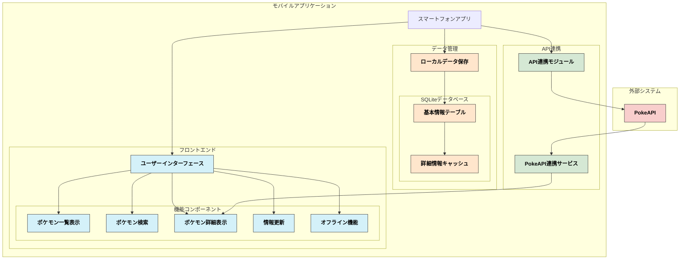
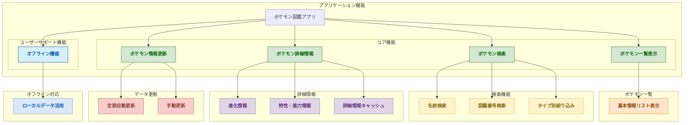
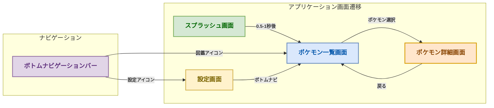
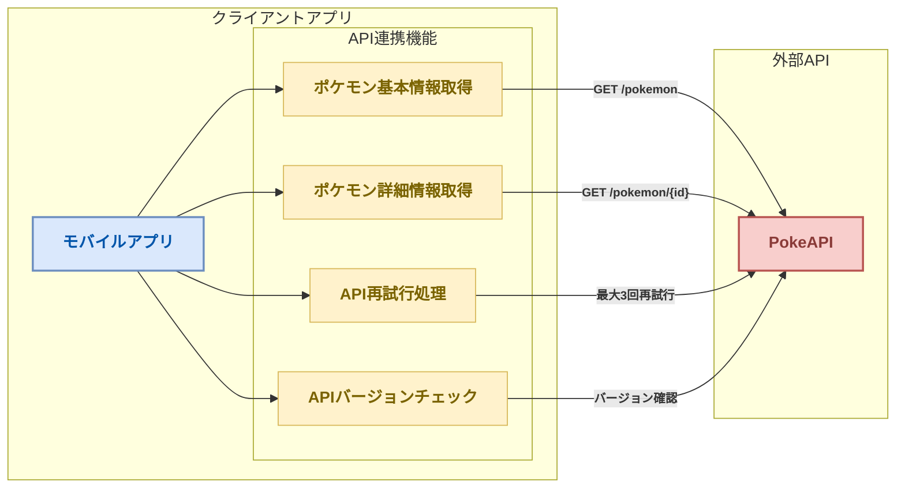
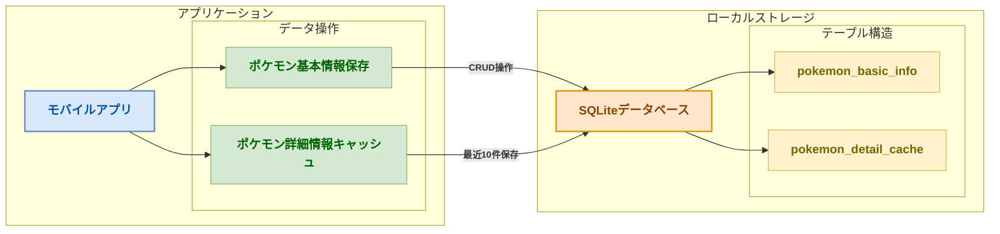

# 基本設計書 — ポケモン図鑑アプリ（カントー地方）

> **本課題の実装対象は Android のみです。**
> iOS や他フレームワークに関する記述は、実際の製品を想定した設計として残しています。
> 実装スコープは [実装仕様](04_実装仕様.md) と [GitHub Issues](https://github.com/sghh02/pokedex-android-kadai/issues) を参照してください。

## 1. はじめに

この基本設計書は、「ポケモン図鑑アプリケーション」のシステム全体像や主要機能の概要を示すものです。
システム設計の基礎となる部分であり、今後の開発作業を進めるための指針となります。

---

## 2. 機能設計

### 2.1 システム方式設計

#### 2.1.1 システム構成図

システム全体の構成としては、次の主要なコンポーネントが含まれます。

- **ハードウェア要件**
    - **クライアント端末**
        - スマートフォン（iOS、Android）
        - 必要OSバージョン：iOS 10以降、Android 8.0以降
- **ソフトウェア要件**
    - **フロントエンド**
        - モバイルアプリ（本課題では Kotlin + Jetpack Compose）
    - **バックエンド**
        - API仕様(RESTful API)
- **フロントエンド（モバイルアプリ）**
    - ユーザーインターフェース(UI)
    - 機能: ポケモンの検索、一覧表示、詳細情報の表示、データ更新など
    - 対応OS: iOS、Android
- **バックエンド（APIサーバー）**
    - REST API
    - ポケモン情報の提供(PokeAPI)
    - **API再試行ポリシー**: 最大3回まで30秒間隔で再試行
    - **APIバージョンチェック機能**: 仕様変更検出のため
- **ローカルデータベース(SQLite)**
    - 一覧表示で使用するポケモンデータ（図鑑番号、画像、名前、タイプ）
    - **最近閲覧した詳細情報キャッシュ**: 最後に閲覧した10件のポケモン詳細情報

#### 2.1.2 アプリケーション機能構成図

以下のアプリケーション機能構成図は、ユーザーが利用する各機能がどのようにアプリケーション内でつながっているかを示しています。

- **ポケモン一覧表示機能**: ユーザーがポケモン一覧を表示し、検索・ソート・絞り込みができる機能。
- **ポケモン詳細表示機能**: ユーザーが特定のポケモンを選択し、その詳細情報（進化等）を表示する機能。
- **ポケモン情報更新機能**: ユーザーが最新のポケモン情報を手動で更新する機能や、アプリ起動時に自動的に情報が更新される機能。
- **オフライン機能**: インターネット接続なしでも基本的なポケモン情報を表示できる機能。

---

### 2.2 画面設計

#### 2.2.1 画面一覧

| No. | **画面名** | **機能** | **操作内容** |
| --- | --- | --- | --- |
| 1 | **スプラッシュ画面** | ・ポケモン基本情報更新機能開始 | ・なし |
| 2 | **ポケモン一覧画面** | ・ポケモンのリスト表示 ・検索機能 ・ソート機能（図鑑番号順） ・タイプ別絞り込み機能 | ・ポケモンをリストからスクロールして選択 ・名前または図鑑番号で検索 ・図鑑番号でソート ・タイプで絞り込み |
| 3 | **ポケモン詳細画面** | ・ポケモンの詳細情報表示（進化情報、進化条件など） ・オフライン表示のためのキャッシュ機能 | ・進化等の情報を確認 ・詳細はオフライン時でもキャッシュから閲覧可能 |
| 4 | **設定画面** | ・手動でのデータ更新 | ・データを手動で更新文字サイズ調整 |

#### 2.2.2 画面遷移図

##### 画面遷移説明

スプラッシュ画面:
アプリ起動後始めに表示される画面。
ポケモン基本情報更新機能を開始する。
表示時間は0.5秒〜1秒に収まるようにし、更新が終わるか関係なく「ポケモン一覧画面」に遷移する。

ポケモン一覧画面:
「ポケモン一覧画面」からは、選択したポケモンの詳細情報を表示するために「ポケモン詳細画面」へ遷移できます。
また、ボトムナビゲーションバーを使って、「設定画面」へ遷移できます。

ポケモン詳細画面:
ユーザーはポケモンの詳細情報を確認後、ヘッダーの戻るボタンか戻るジェスチャーを使用して「ポケモン一覧画面」へ戻ることができます。
詳細情報は自動的にキャッシュされ、最後に閲覧した10件はオフラインでも参照可能です。

設定画面:
ユーザーは「設定画面」で手動でデータ更新ができます。
設定画面からもボトムナビゲーションバーを使用して「ポケモン一覧画面」に遷移可能です。

#### 2.2.3 画面レイアウト

以下を参照

[Figma: ポケモン図鑑(カントー地方)デザイン](https://www.figma.com/design/b0kI8aTikCubCeKQdcSKEC/%E3%83%9D%E3%82%B1%E3%83%A2%E3%83%B3%E5%9B%B3%E9%91%91%28%E3%82%AB%E3%83%B3%E3%83%88%E3%83%BC%E5%9C%B0%E6%96%B9%29%E3%83%87%E3%82%B6%E3%82%A4%E3%83%B3?node-id=3-40&t=c3mklPkvnhvy8Sp5-1)

---

### 2.3 外部インターフェース設計

外部インターフェース設計では、アプリが他のシステムとどのように通信するかを詳細に定義します。
このアプリでは、外部インターフェースとして PokeAPI を使用してポケモン情報を取得します。

#### 2.3.1 外部システム関連図

##### 外部システム関連図説明

モバイルアプリ:
ユーザーが操作するアプリ部分。
PokeAPIと連携してデータを取得、更新します。また、API障害時の再試行やバージョンチェックも行います。

PokeAPI:
外部APIで、ポケモン情報（基本データや詳細情報）を提供します。

#### 2.3.2 外部インターフェース一覧

| No. | **インターフェース名** | **インターフェースの種類** | **外部システム名** | **利用目的** | **インターフェース詳細** |
| --- | --- | --- | --- | --- | --- |
| 1 | **PokeAPI** | RESTful API | PokeAPI | ポケモン情報の取得（基本データ、進化情報など） | ・ポケモンの基本データ（番号、名前、タイプ、進化情報など）を取得する。 ・リクエストはHTTPSで行い、レスポンスをJSON形式で受け取る。 ・最大3回まで30秒間隔で再試行し、API障害に備える。 |

##### 外部インターフェース説明

1. **PokeAPI**:
    - 外部のポケモン情報を提供するAPI。モバイルアプリがポケモンの基本情報や進化情報などを取得するために利用します。
    - 通信はすべてHTTPSで行い、証明書ピン留めによる中間者攻撃防止を実装します。
    - API仕様変更検出のためバージョン情報を確認し、必要に応じてアップデートを促す仕組みを実装します。
    - 取得失敗時は最大3回まで30秒間隔で自動的に再試行します。

#### 2.3.3 外部インターフェース定義

**1. PokeAPI**

以下を参照
Swaggerで作成する

##### エラー処理

PokeAPIを利用する際のエラー処理は、以下の通り定義します。

1. **ネットワークエラー**
    - **原因**: ネットワークの接続不良、タイムアウトなど。
    - **対応方法**:
        - ユーザーに「ネットワーク接続を確認してください」というメッセージを表示。
        - 再試行ボタンを提供し、最大3回まで30秒間隔で自動的に再試行を行う。
        - リトライ後も失敗した場合は、オフラインモードに切り替えるか、キャッシュされたデータを表示。
2. **APIレスポンスエラー**
    - **原因**: APIからのレスポンスが異常、ステータスコードがエラー（例: 500, 404）など。
    - **対応方法**:
        - エラーメッセージをユーザーに表示。
        - リトライオプションの提供。
        - 最大3回まで30秒間隔で自動的に再試行を行う。
        - 10件までのキャッシュされた詳細情報を提供。
3. **不正なデータエラー**
    - **原因**: APIからのレスポンスが期待される形式ではない（JSON解析エラーなど）。
    - **対応方法**:
        - ユーザーには「データの取得に失敗しました」と表示。
        - ログを記録し、開発者にフィードバックする。
        - キャッシュされたデータがある場合は表示し、その旨をユーザーに通知。

---

### 2.4 内部インターフェース定義

#### 2.4.1 内部システム関連図

##### 内部システム関連図説明

モバイルアプリ:
ユーザーが操作するアプリ部分。
PokeAPIから取得したデータをSQLiteに保存、取得します。また、最近閲覧した詳細情報のキャッシュも行います。

SQLite:
SQLiteは軽量で自己完結型のローカルデータベース管理システム。

#### 2.4.2 内部インターフェース一覧

| No. | **インターフェース名** | **インターフェースの種類** | **内部システム名** | **利用目的** | **インターフェース詳細** |
| --- | --- | --- | --- | --- | --- |
| 1 | **SQLite** | ローカルデータベース | SQLite | ポケモンの基本情報の保存とキャッシュ | ・保存: ユーザーが取得したポケモン情報をローカルデータベースに保存 ・取得: ローカルデータベースからポケモン情報を取得 ・キャッシュ: 最近閲覧した10件の詳細情報を保存 |

**内部インターフェース説明**

1. **SQLite**:
    - SQLiteは軽量で自己完結型のローカルデータベース管理システムで、外部サーバーと接続せずにデータベースをローカル環境内で直接操作できます。
    - ポケモンの基本情報（ポケモンの図鑑番号、画像、名前、タイプ）をデバイス内に保存し、ユーザーが獲得したポケモンデータを効率的に管理するために使用されます。
    - 最近閲覧した10件のポケモン詳細情報をキャッシュとして保存し、オフライン時でも参照可能にします。
    - ユーザー設定情報を暗号化して保存し、セキュリティを確保します。
    - データ保存容量は初期状態で約10MB以内に収めます。

#### 2.4.3 テーブル構成

**1. テーブル名: pokemon_basic_info**

| カラム名 | データ型 | 説明 |
| --- | --- | --- |
| **id** | `INT` （自動インクリメント） | 主キー。ポケモンの一意識別用。 |
| **pokedex_number** | `INT` | ポケモンの図鑑番号（例：001, 002, ...）。ユニーク制約。 |
| **name** | `VARCHAR(255)` | ポケモンの名前（例：ピカチュウ、リザードン）。 |
| **type_1** | `VARCHAR(50)` | 主タイプ（例：でんき、ほのお、みず）。 |
| **type_2** | `VARCHAR(50)` | サブタイプ（例：ふゆう、ひこう）。NULLも許容。 |
| **image_url** | `VARCHAR(255)` | ポケモンの画像URL（外部リンク）。 |
| **last_updated** | `TIMESTAMP` | 最終更新日時。データ鮮度の確認用。 |

**2. テーブル名: pokemon_detail_cache**

| カラム名 | データ型 | 説明 |
| --- | --- | --- |
| **id** | `INT` （自動インクリメント） | 主キー。キャッシュエントリの一意識別用。 |
| **pokedex_number** | `INT` | ポケモンの図鑑番号。pokemon_basic_infoの外部キー。 |
| **evolution_chain** | `TEXT` | 進化情報をJSON形式で保存。 |
| **moves** | `TEXT` | 技情報をJSON形式で保存。 |
| **last_viewed** | `TIMESTAMP` | 最後に閲覧した日時。古いキャッシュ削除用。 |
| **cached_on** | `TIMESTAMP` | キャッシュした日時。データ鮮度の確認用。 |

---

### 2.5 パフォーマンス設計

パフォーマンス設計では、アプリが効率的に動作するための性能基準を定義します。

#### 2.5.1 パフォーマンス目標

| 項目 | 目標値 | 説明 |
| --- | --- | --- |
| **画面遷移時間** | 300ms以内 | 画面間の遷移にかかる時間 |
| **データ読み込み時間** | 2秒以内 | 通常のネットワーク環境下でのデータ読み込み時間 |
| **アプリサイズ** | 30MB以下 | 初期インストール時のアプリケーションサイズ |
| **メモリ使用量** | 100MB以下 | アプリケーション実行時の最大メモリ使用量 |
| **ローカルストレージ使用量** | 10MB以内 | アプリケーションのローカルストレージ使用量（初期状態） |

#### 2.5.2 最適化戦略

1. **イメージの最適化**
    - ポケモン画像はキャッシュし、再読み込みを最小限に抑える
    - 適切な解像度とフォーマットを使用し、ファイルサイズを小さく保つ
2. **データ取得の最適化**
    - 一覧表示に必要な最小限のデータのみを最初に取得
    - 詳細データは必要に応じて遅延読み込み
3. **キャッシュ戦略**
    - 最近閲覧した10件のポケモン詳細情報をキャッシュとして保存
    - 一覧データは完全にローカルに保存し、オフラインでも利用可能に

---

### 2.6 テスト計画

#### 2.6.1 テスト種類と範囲

| テスト種類 | 説明 | 実施タイミング |
| --- | --- | --- |
| **ユニットテスト** | 各機能の個別コンポーネントのテスト | 開発中随時 |
| **統合テスト** | 複数のコンポーネントを組み合わせたテスト | 機能実装後 |
| **UI/UXテスト** | ユーザーインターフェースと操作性のテスト | プロトタイプ完成後 |
| **互換性テスト** | 様々な画面サイズとデバイスでの互換性テスト | ベータ版前 |
| **パフォーマンステスト** | 応答速度、メモリ使用量などのテスト | ベータ版前 |
| **セキュリティテスト** | データ保護機能、通信セキュリティのテスト | ベータ版前 |

#### 2.6.2 テストスケジュール

- プロトタイプ完成後2週間以内に内部テストを実施
- ベータ版公開1ヶ月前にユーザー受け入れテストを開始

---

### 2.7 セキュリティ設計

#### 2.7.1 データ保護

1. **ローカルデータの暗号化**
    - ユーザーデータは端末内で暗号化して保存
    - SQLiteデータベースへのアクセス制限
2. **通信セキュリティ**
    - PokeAPIとの通信はすべてHTTPSで実施
    - 証明書ピン留めによる中間者攻撃防止

#### 2.7.2 セキュリティ対策

| 脅威 | 対策 |
| --- | --- |
| **データ漏洩** | データの暗号化保存、最小限の情報収集 |
| **中間者攻撃** | HTTPS通信、証明書ピン留め |
| **不正アクセス** | アプリ内データへのアクセス制限 |

---

### 2.8 運用・保守計画

#### 2.8.1 バグ修正ポリシー

- 重大なバグは48時間以内に修正版をリリース
- 軽微なバグは2週間以内に修正版をリリース

#### 2.8.2 アップデート頻度

- 機能追加は3ヶ月ごとに実施
- バグ修正は必要に応じて随時実施

#### 2.8.3 サポート期間

- 正式リリースから最低2年間のサポートを提供

#### 2.8.4 ユーザーフィードバック収集

- ベータテスト期間中にユーザーからのフィードバックを収集するためのフォームを提供
- アプリ内からバグ報告や機能改善の提案を送信できる仕組みを実装

---

## 付録: 基本設計とは

> 設計工程そのものの解説です。アプリの仕様ではありません。

### 開発プロジェクトとは

開発プロジェクトとは、ソフトウェアやシステムを作成するための組織的な取り組みです。これは単にプログラムを書くだけではなく、計画から実装、テスト、リリースまでの全工程を含みます。

### 基本設計の位置づけ

基本設計（Basic Design）は、開発プロジェクトの初期段階で行われる重要なプロセスです。これは要件定義の後に行われ、システムの骨組みを決定する段階です。

### 基本設計のプロセス

#### 1. 要件の確認

まず、顧客やユーザーの要望（要件）を十分に理解することから始めます。これにより、作るべきものの目的や機能が明確になります。

#### 2. システム全体の構造決定

システムをどのように構成するかの大枠を決めます。例えば、ウェブアプリケーションであれば、フロントエンド（見た目の部分）とバックエンド（裏側で動く部分）の分離などを決定します。

#### 3. データ設計

システムで扱うデータの種類と構造を決めます。データベースを使用する場合は、テーブル設計や関連性の定義も行います。

#### 4. インターフェース設計

システムの利用者がどのように操作するか、また他のシステムとどのように連携するかを決めます。画面のレイアウトや機能配置なども含まれます。

#### 5. セキュリティ設計

情報漏洩やシステム障害を防ぐための対策を計画します。ユーザー認証やデータ暗号化などの方法を決定します。

### 基本設計の成果物

基本設計の結果として、以下のような文書が作成されます：

- システム構成図：システム全体の構造を視覚的に表現したもの
- 画面設計書：ユーザーインターフェースの詳細
- データベース設計書：データの保存方法や関連性の詳細
- 外部インターフェース仕様書：他システムとの連携方法

### 基本設計の重要性

基本設計は後工程の詳細設計や実装の基盤となるため、ここでの判断ミスは後の大幅な修正につながる可能性があります。そのため、十分な検討と関係者間での合意形成が重要です。

### まとめ

基本設計とは、開発プロジェクトにおいて「何を」「どのように」作るかの骨組みを決める重要なプロセスです。明確で適切な基本設計があれば、後の工程がスムーズに進み、品質の高いシステムを効率的に開発することができます。
