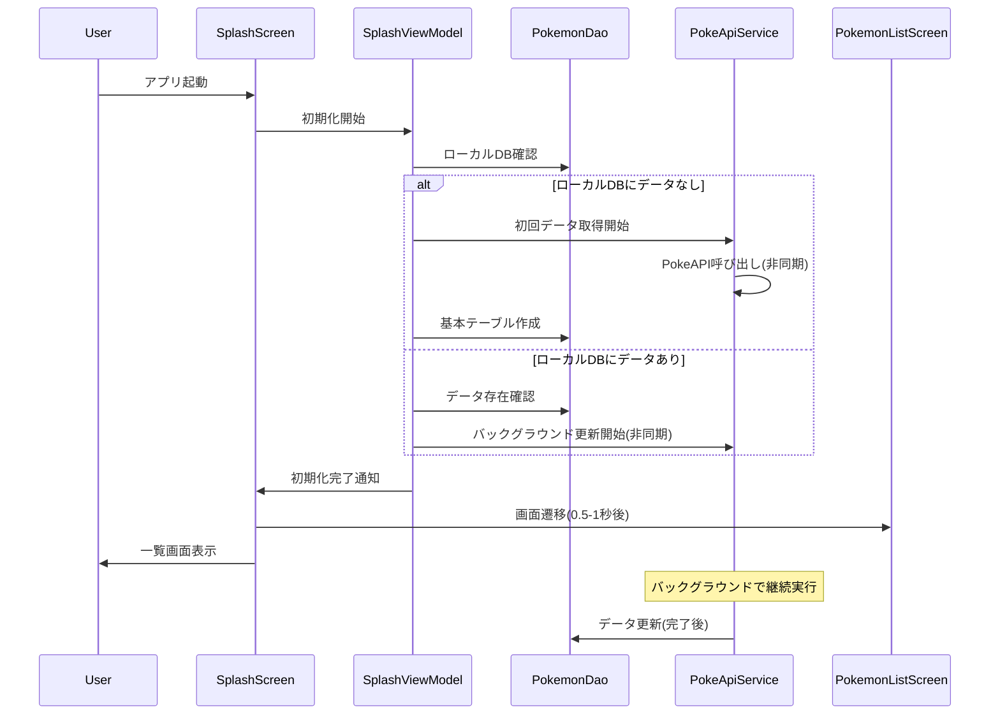
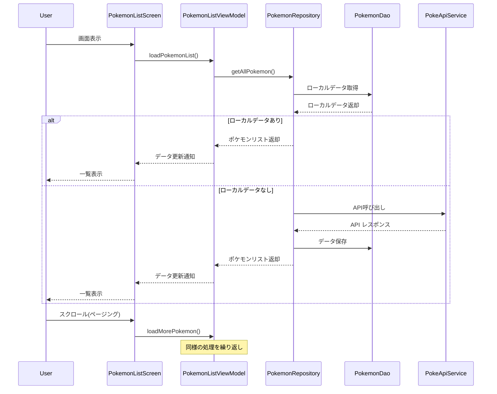
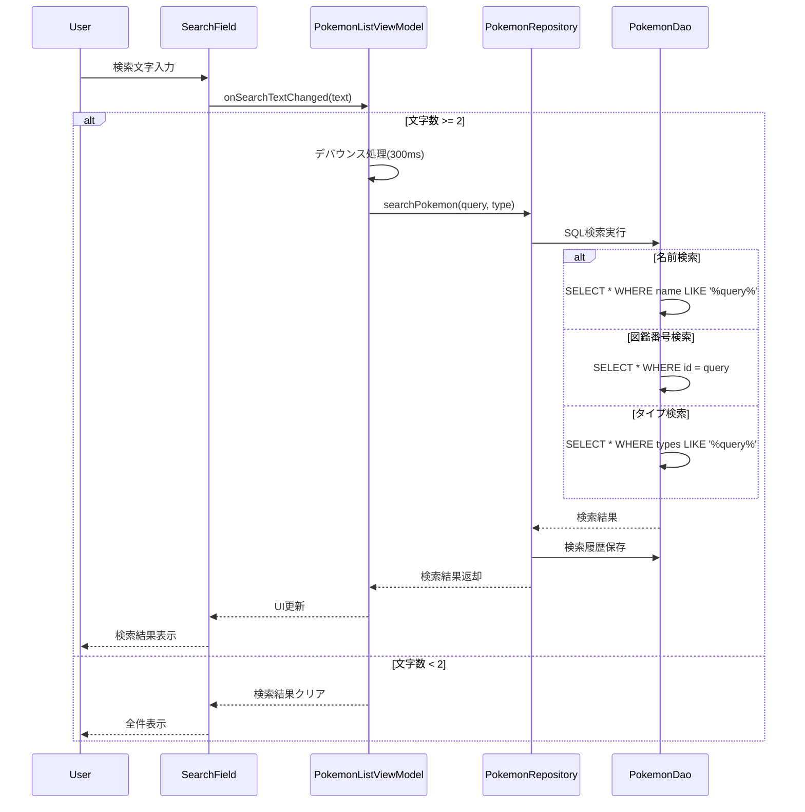
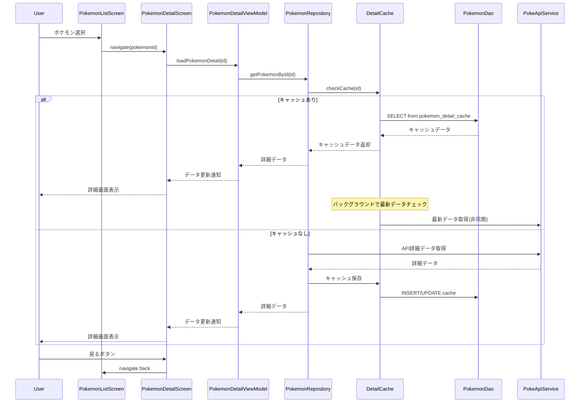
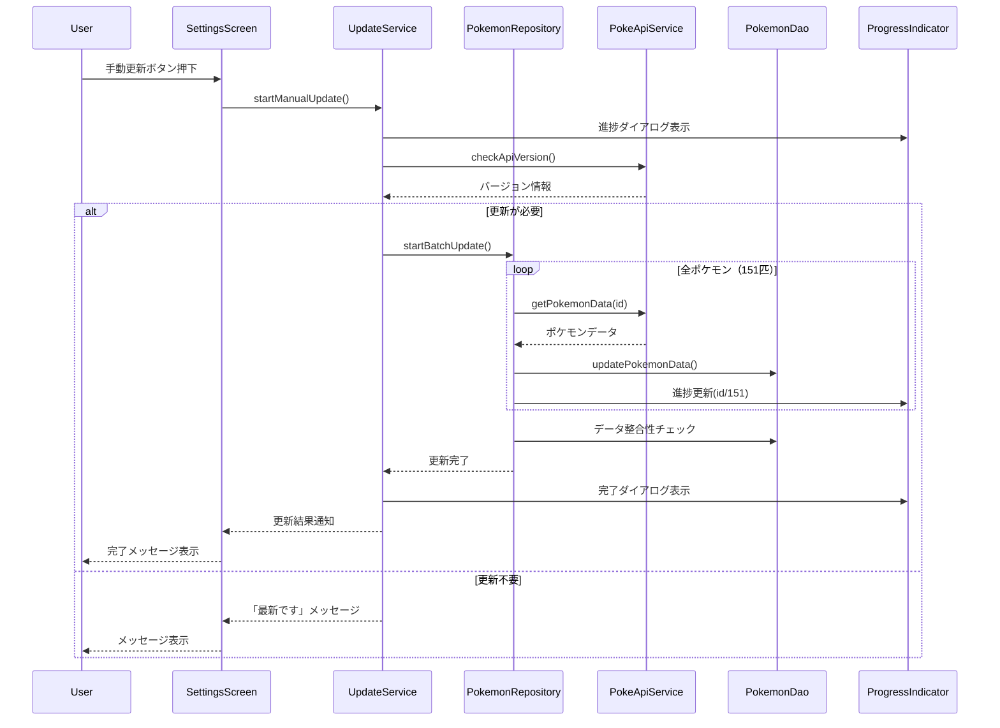
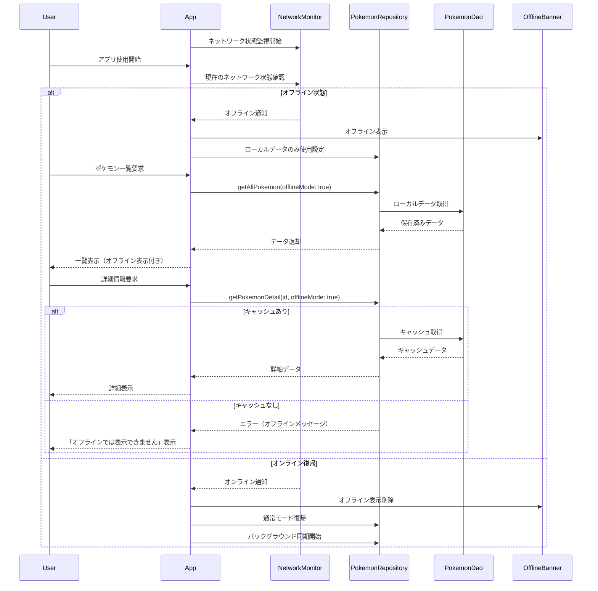

# 詳細設計書 — ポケモン図鑑アプリ（カントー地方）

## はじめに

この詳細設計書は、[要件定義](01_要件定義.md)と[基本設計](02_基本設計.md)に基づき、そのまま実装に着手できる粒度まで設計を具体化したものです。

コード例は **Kotlin + Jetpack Compose** で記載しています。そのまま貼って動くものではなく、
設計の意図を伝えるためのスケッチです。import 文とテーマ定義は省略しています。

次のものは意図的に省いています。各 Issue で自分で実装してください。

- DTO からモデル・Entity への変換（`toEntity()` / `toDetail()`）
- 見た目を決める Composable（`PokemonGridItem` / `SearchField` / `LoadingIndicator`）
- 画面遷移の定義（`PokedexNavHost`）

実装するスコープと評価の基準は[実装仕様](04_実装仕様.md)、
作業の単位は [GitHub Issues](https://github.com/sghh02/pokedex-android-kadai/issues) にまとめてあります。

### 設計原則

- **レイヤードアーキテクチャ**: Presentation / Business / Data / Infrastructure の4層構成
- **SOLID原則**: 保守性と拡張性を重視した設計
- **パフォーマンス最適化**: ユーザー体験を左右する応答性の確保
- **オフラインファースト**: ネットワーク状況に依存しない堅牢な設計

### この文書の構成

1. 全体アーキテクチャ — レイヤー構成と主要コンポーネント
2. データ構造設計 — 型定義とSQLiteテーブル
3. API設計 — PokeAPIの利用仕様と内部インターフェース
4. 機能詳細設計 — 機能ごとのシーケンス図・実装例・エラーハンドリング
5. エラーハンドリング — 例外の分類と共通処理
6. パフォーマンス設計 — 目標値と最適化方針

---

---

## 1. 全体アーキテクチャ

### 1.1 レイヤー構成

```
┌─────────────────────────────────────┐
│        Presentation Layer           │ ← Composable（*Screen）
├─────────────────────────────────────┤
│         Business Layer              │ ← ViewModel（状態と画面ロジック）
├─────────────────────────────────────┤
│         Data Layer                  │ ← Repository / UpdateService / DetailCache
├─────────────────────────────────────┤
│      Infrastructure Layer           │ ← PokeApiService / Room / NetworkMonitor
└─────────────────────────────────────┘
```

[実装仕様](04_実装仕様.md)では同じ構造を Android の慣用名で
「UI / ViewModel / Repository / Data Sources」と呼んでいます。対応は次のとおりです。

| 本書 | 実装仕様 | 実装上の型 |
| --- | --- | --- |
| Presentation | UI Layer | `@Composable fun *Screen` |
| Business | ViewModel Layer | `*ViewModel`（`StateFlow` で状態を公開） |
| Data | Repository Layer | `PokemonRepository` / `UpdateService` / `DetailCache` |
| Infrastructure | Data Sources Layer | `PokeApiService` / `PokemonDao` / `NetworkMonitor` |

### 1.2 主要コンポーネント

| コンポーネント | 役割 | 層 |
| --- | --- | --- |
| `PokemonRepository` | API とローカルDBを束ね、画面に単一の入口を提供する | Data |
| `PokeApiService` | PokeAPI との通信（Retrofit インターフェース） | Infrastructure |
| `PokemonDao` / `AppDatabase` | Room によるローカル永続化 | Infrastructure |
| `DetailCache` | 詳細情報のキャッシュ（直近10件・LRU） | Data |
| `UpdateService` | 151匹ぶんの取得と再試行の制御 | Data |
| `NetworkMonitor` | ネットワーク状態の監視 | Infrastructure |
| `*ViewModel` | 画面ごとの状態保持（StateFlow で公開） | Business |
| `*Screen` | Composable による画面描画 | Presentation |

---

## 2. データ構造設計

### 2.1 Pokemon基本情報

```kotlin
// domain/model/Pokemon.kt — 画面が扱うモデル
data class Pokemon(
    val id: Int,
    val name: String,        // 英語名。一覧APIから取得
    val nameJa: String?,     // 日本語名。pokemon-species から取得（Phase 2）
    val imageUrl: String?,
    val type1: String?,
    val type2: String?,
    val heightDm: Int,       // APIの生値（デシメートル）
    val weightHg: Int,       // APIの生値（ヘクトグラム）
) {
    val displayName: String get() = nameJa ?: name
    val heightMeters: Double get() = heightDm / 10.0   // 7 → 0.7 m
    val weightKg: Double get() = weightHg / 10.0       // 69 → 6.9 kg
    val types: List<String> get() = listOfNotNull(type1, type2)
}
```

```kotlin
// data/local/PokemonEntity.kt — Room の保存形式
@Entity(
    tableName = "pokemon",
    indices = [Index("name"), Index("name_ja"), Index("type1"), Index("type2")],
)
data class PokemonEntity(
    @PrimaryKey val id: Int,
    val name: String,
    @ColumnInfo(name = "name_ja") val nameJa: String? = null,
    @ColumnInfo(name = "image_url") val imageUrl: String? = null,
    val height: Int,
    val weight: Int,
    val type1: String? = null,
    val type2: String? = null,
    @ColumnInfo(name = "created_at") val createdAt: Long = System.currentTimeMillis(),
)

fun PokemonEntity.toDomain() = Pokemon(id, name, nameJa, imageUrl, type1, type2, height, weight)
```

### 2.2 Pokemon詳細情報

```kotlin
// domain/model/PokemonDetail.kt
data class PokemonDetail(
    val pokemon: Pokemon,
    val abilities: List<Ability>,
    val stats: List<Stat>,
    val evolutions: List<Evolution>,
    val flavorTextJa: String?,   // pokemon-species の日本語説明文
)

data class Ability(
    val name: String,
    val isHidden: Boolean,       // 隠れ特性かどうか
)

data class Stat(
    val name: String,            // hp / attack / defense ...
    val value: Int,
) {
    companion object { const val MAX_VALUE = 255 }
}

data class Evolution(
    val fromId: Int,
    val toId: Int,
    val condition: String,       // 例: "レベル16"
)
```

### 2.3 SQLiteテーブル設計

Room が生成するスキーマは次のとおりです。日付はエポックミリ秒（`INTEGER`）で保持します。

```sql
-- ポケモン基本情報
CREATE TABLE pokemon (
    id         INTEGER PRIMARY KEY,   -- 図鑑番号
    name       TEXT    NOT NULL,      -- 英語名
    name_ja    TEXT,                  -- 日本語名（Phase 2）
    image_url  TEXT,
    height     INTEGER,               -- デシメートル（APIの生値）
    weight     INTEGER,               -- ヘクトグラム（APIの生値）
    type1      TEXT,
    type2      TEXT,                  -- 単タイプのポケモンは NULL
    created_at INTEGER NOT NULL
);

CREATE INDEX idx_pokemon_name    ON pokemon(name);
CREATE INDEX idx_pokemon_name_ja ON pokemon(name_ja);
CREATE INDEX idx_pokemon_type1   ON pokemon(type1);
CREATE INDEX idx_pokemon_type2   ON pokemon(type2);

-- 詳細情報のキャッシュ（直近10件のみ保持）
CREATE TABLE pokemon_detail_cache (
    id            INTEGER PRIMARY KEY,
    detail_json   TEXT    NOT NULL,
    cached_at     INTEGER NOT NULL,
    last_accessed INTEGER NOT NULL,   -- LRU の判定に使う
    FOREIGN KEY (id) REFERENCES pokemon(id)
);

CREATE INDEX idx_cache_last_accessed ON pokemon_detail_cache(last_accessed);
```

タイプは `type1` / `type2` の個別カラムに分けています。
JSON配列で持つとタイプ検索が `LIKE` になりインデックスが効かないためです。

---

## 3. API設計

### 3.1 PokeAPI エンドポイント仕様

#### 3.1.1 ポケモン一覧取得

```
GET https://pokeapi.co/api/v2/pokemon/?limit=151&offset=0
```

**レスポンス例:**

```json
{
  "count": 151,
  "results": [
    {
      "name": "bulbasaur",
      "url": "https://pokeapi.co/api/v2/pokemon/1/"
    }
  ]
}
```

#### 3.1.2 ポケモン詳細取得

```
GET https://pokeapi.co/api/v2/pokemon/{id}/
```

### 3.2 内部API設計

#### 3.2.1 PokemonRepository Interface

```kotlin
// data/repository/PokemonRepository.kt
interface PokemonRepository {

    /** 一覧はローカルDBを唯一の情報源とする。DBが更新されれば画面へ自動的に流れる。 */
    fun observePokemonList(): Flow<List<Pokemon>>

    /** 検索も DB に対して行う。query が空なら全件を返す。 */
    fun searchPokemon(query: String): Flow<List<Pokemon>>

    /** 詳細は API から取得し、直近10件をキャッシュする。 */
    suspend fun getPokemonDetail(id: Int): Result<PokemonDetail>

    /** API から取得して DB を更新する。onProgress は (完了数, 総数)。 */
    suspend fun refresh(onProgress: (done: Int, total: Int) -> Unit = { _, _ -> }): Result<Unit>

    /** 最終更新日時（エポックミリ秒）。未更新なら null。 */
    suspend fun lastUpdatedAt(): Long?
}
```

---

## 4. 機能詳細設計

### 4.1 アプリ起動・初期化機能

#### 4.1.1 機能概要

アプリ起動時にスプラッシュ画面を表示し、初期データ取得と画面遷移を行う。

#### 4.1.2 処理フロー



#### 4.1.3 実装仕様

##### SplashScreen（Composable）

```kotlin
// ui/splash/SplashScreen.kt
private const val MINIMUM_DISPLAY_MS = 500L   // 要件: 0.5〜1秒

@Composable
fun SplashScreen(
    onFinished: () -> Unit,
    viewModel: SplashViewModel = viewModel(factory = LocalAppContainer.current.viewModelFactory),
) {
    LaunchedEffect(Unit) {
        // 初期化の成否にかかわらず一覧へ進む。起動を止めないことを優先する。
        val elapsed = measureTimeMillis { viewModel.initialize() }
        delay((MINIMUM_DISPLAY_MS - elapsed).coerceAtLeast(0L))
        onFinished()
    }

    Box(Modifier.fillMaxSize(), contentAlignment = Alignment.Center) {
        Image(
            painter = painterResource(R.drawable.ic_pokedex),
            contentDescription = null,
        )
    }
}

class SplashViewModel(private val repository: PokemonRepository) : ViewModel() {
    suspend fun initialize() {
        repository.refresh()
            .onFailure { Log.w(TAG, "初期データの取得に失敗。保存済みデータで継続する", it) }
    }

    private companion object { const val TAG = "SplashViewModel" }
}
```

##### Application と依存の組み立て

```kotlin
// PokedexApplication.kt — アプリ全体の初期化と依存の組み立て
class PokedexApplication : Application() {
    lateinit var container: AppContainer
        private set

    override fun onCreate() {
        super.onCreate()
        container = AppContainer(this)
    }
}

/**
 * 手動DIのコンテナ。Hilt を導入する場合は @Module に置き換える。
 * Phase 1 はこの形で十分に動く。
 */
class AppContainer(context: Context) {

    private val json = Json { ignoreUnknownKeys = true }

    private val database = Room
        .databaseBuilder(context, AppDatabase::class.java, "pokedex.db")
        .fallbackToDestructiveMigration()   // 学習用途。データは API から取り直せる
        .build()

    private val okHttp = OkHttpClient.Builder()
        .addInterceptor(
            HttpLoggingInterceptor().apply {
                // リリースビルドではログを出さない
                level = if (BuildConfig.DEBUG) HttpLoggingInterceptor.Level.BODY
                        else HttpLoggingInterceptor.Level.NONE
            }
        )
        .build()

    private val api: PokeApiService = Retrofit.Builder()
        .baseUrl(PokeApiService.BASE_URL)
        .client(okHttp)
        .addConverterFactory(json.asConverterFactory("application/json".toMediaType()))
        .build()
        .create(PokeApiService::class.java)

    val networkMonitor = NetworkMonitor(context)

    val pokemonRepository: PokemonRepository = DefaultPokemonRepository(
        api = api,
        dao = database.pokemonDao(),
        detailCache = DetailCache(database.detailCacheDao(), json),
        networkMonitor = networkMonitor,
        updateService = UpdateService(api, database.pokemonDao()),
    )

    /** ViewModel に依存を渡すためのファクトリ */
    val viewModelFactory = viewModelFactory {
        initializer { SplashViewModel(pokemonRepository) }
        initializer { PokemonListViewModel(pokemonRepository, networkMonitor) }
        initializer { PokemonDetailViewModel(pokemonRepository) }
    }
}

/** Composable から AppContainer を引くための CompositionLocal */
val LocalAppContainer = staticCompositionLocalOf<AppContainer> {
    error("AppContainer が提供されていません")
}

// MainActivity の setContent で流し込む
setContent {
    CompositionLocalProvider(
        LocalAppContainer provides (application as PokedexApplication).container
    ) {
        PokedexTheme { PokedexNavHost() }
    }
}
```

---

### 4.2 ポケモン一覧表示機能

#### 4.2.1 機能概要

カントー地方のポケモン151匹を一覧表示し、検索・絞り込み機能を提供する。

#### 4.2.2 処理フロー



#### 4.2.3 実装仕様

##### PokemonListScreen（Composable）

```kotlin
// ui/list/PokemonListScreen.kt
@Composable
fun PokemonListScreen(
    onPokemonClick: (Int) -> Unit,
    viewModel: PokemonListViewModel = viewModel(factory = LocalAppContainer.current.viewModelFactory),
) {
    val uiState by viewModel.uiState.collectAsStateWithLifecycle()

    Column {
        OfflineBanner(visible = uiState.isOffline)

        SearchField(
            query = uiState.query,
            onQueryChange = viewModel::onQueryChange,
        )

        PullToRefreshBox(
            isRefreshing = uiState.isRefreshing,
            onRefresh = viewModel::refresh,
        ) {
            // LazyVerticalGrid は画面に見えているセルだけを構成するため、
            // 151件をそのまま渡してよい。手動のページングは不要。
            LazyVerticalGrid(
                columns = GridCells.Fixed(2),
                contentPadding = PaddingValues(8.dp),
                verticalArrangement = Arrangement.spacedBy(8.dp),
                horizontalArrangement = Arrangement.spacedBy(8.dp),
            ) {
                items(uiState.pokemonList, key = { it.id }) { pokemon ->
                    PokemonGridItem(
                        pokemon = pokemon,
                        onClick = { onPokemonClick(pokemon.id) },
                    )
                }
            }
        }
    }
}
```

##### PokemonListViewModel

```kotlin
// ui/list/PokemonListViewModel.kt
data class PokemonListUiState(
    val pokemonList: List<Pokemon> = emptyList(),
    val query: String = "",
    val isRefreshing: Boolean = false,
    val isOffline: Boolean = false,
    val errorMessage: String? = null,
) {
    val isEmpty: Boolean get() = pokemonList.isEmpty() && query.isNotBlank()
}

@OptIn(FlowPreview::class, ExperimentalCoroutinesApi::class)
class PokemonListViewModel(
    private val repository: PokemonRepository,
    networkMonitor: NetworkMonitor,
) : ViewModel() {

    private val query = MutableStateFlow("")
    private val isRefreshing = MutableStateFlow(false)
    private val errorMessage = MutableStateFlow<String?>(null)

    private val pokemonList = query
        .debounce(300)              // 入力のたびに検索が走らないようにする
        .distinctUntilChanged()
        .flatMapLatest { repository.searchPokemon(it) }   // 前の検索は自動的に打ち切られる

    val uiState: StateFlow<PokemonListUiState> = combine(
        pokemonList, query, isRefreshing, networkMonitor.isOnline, errorMessage,
    ) { list, q, refreshing, online, error ->
        PokemonListUiState(list, q, refreshing, isOffline = !online, errorMessage = error)
    }.stateIn(
        scope = viewModelScope,
        started = SharingStarted.WhileSubscribed(5_000),   // 画面回転では購読を切らない
        initialValue = PokemonListUiState(),
    )

    fun onQueryChange(text: String) { query.value = text }

    fun refresh() {
        viewModelScope.launch {
            isRefreshing.value = true
            errorMessage.value = null
            repository.refresh().onFailure { errorMessage.value = it.toUserMessage() }
            isRefreshing.value = false
        }
    }

    fun consumeError() { errorMessage.value = null }
}
```

---

### 4.3 ポケモン検索機能

#### 4.3.1 機能概要

名前、図鑑番号、タイプによるポケモン検索機能を提供する。

#### 4.3.2 処理フロー



#### 4.3.3 実装仕様

##### 検索の状態管理

```kotlin
// 検索は一覧画面の ViewModel に統合する。専用の ViewModel は作らない。
// 入力文字列から検索の種類を判定し、DAO のクエリを使い分ける。

enum class SearchType { ID, TYPE, NAME }

/** ポケモンのタイプ名（PokeAPI の英語表記） */
val POKEMON_TYPES = setOf(
    "normal", "fire", "water", "electric", "grass", "ice", "fighting", "poison",
    "ground", "flying", "psychic", "bug", "rock", "ghost", "dragon", "dark", "steel", "fairy",
)

fun detectSearchType(query: String): SearchType = when {
    query.toIntOrNull() != null -> SearchType.ID
    query.lowercase() in POKEMON_TYPES -> SearchType.TYPE
    else -> SearchType.NAME
}

// ViewModel 側でのデバウンス（PokemonListViewModel から抜粋）
private val pokemonList = query
    .debounce(300)                                    // 300ms 入力が止まってから検索する
    .distinctUntilChanged()                           // 同じ文字列で二重に検索しない
    .flatMapLatest { repository.searchPokemon(it) }   // 新しい入力が来たら前の検索は破棄
```

##### PokemonRepository 検索実装

```kotlin
// data/local/PokemonDao.kt — 検索は SQL に任せる（インデックスが効く）
@Dao
interface PokemonDao {

    @Query("SELECT * FROM pokemon ORDER BY id")
    fun observeAll(): Flow<List<PokemonEntity>>

    @Query("SELECT * FROM pokemon WHERE id = :id")
    fun observeById(id: Int): Flow<List<PokemonEntity>>

    // SQLite の LIKE は ASCII について大文字小文字を区別しない
    @Query(
        """
        SELECT * FROM pokemon
        WHERE name LIKE '%' || :query || '%'
           OR name_ja LIKE '%' || :query || '%'
        ORDER BY id
        """
    )
    fun searchByName(query: String): Flow<List<PokemonEntity>>

    @Query("SELECT * FROM pokemon WHERE type1 = :type OR type2 = :type ORDER BY id")
    fun searchByType(type: String): Flow<List<PokemonEntity>>

    @Upsert
    suspend fun upsertAll(pokemon: List<PokemonEntity>)

    @Query("SELECT COUNT(*) FROM pokemon")
    suspend fun count(): Int

    @Query("SELECT MAX(created_at) FROM pokemon")
    suspend fun latestCreatedAt(): Long?
}

// data/repository/DefaultPokemonRepository.kt
override fun searchPokemon(query: String): Flow<List<Pokemon>> {
    val trimmed = query.trim()
    val source = when {
        trimmed.isEmpty() -> dao.observeAll()
        else -> when (detectSearchType(trimmed)) {
            SearchType.ID -> dao.observeById(trimmed.toInt())
            SearchType.TYPE -> dao.searchByType(trimmed.lowercase())
            SearchType.NAME -> dao.searchByName(trimmed)
        }
    }
    return source.map { entities -> entities.map { it.toDomain() } }
}
```

---

### 4.4 ポケモン詳細表示機能

#### 4.4.1 機能概要

選択されたポケモンの詳細情報（進化、特性、能力値等）を表示する。

#### 4.4.2 処理フロー



#### 4.4.3 実装仕様

##### PokemonDetailScreen（Composable）

```kotlin
// ui/detail/PokemonDetailScreen.kt
@Composable
fun PokemonDetailScreen(
    pokemonId: Int,
    onBack: () -> Unit,
    viewModel: PokemonDetailViewModel = viewModel(factory = LocalAppContainer.current.viewModelFactory),
) {
    val uiState by viewModel.uiState.collectAsStateWithLifecycle()

    LaunchedEffect(pokemonId) { viewModel.load(pokemonId) }

    Scaffold(
        topBar = {
            TopAppBar(
                title = { Text((uiState as? DetailUiState.Success)?.detail?.pokemon?.displayName.orEmpty()) },
                navigationIcon = {
                    IconButton(onClick = onBack) {
                        Icon(Icons.AutoMirrored.Filled.ArrowBack, contentDescription = "戻る")
                    }
                },
            )
        },
    ) { padding ->
        when (val state = uiState) {
            DetailUiState.Loading -> LoadingIndicator(Modifier.padding(padding))
            is DetailUiState.Error -> ErrorMessage(
                message = state.message,
                onRetry = { viewModel.load(pokemonId) },
                modifier = Modifier.padding(padding),
            )
            is DetailUiState.Success -> DetailContent(state.detail, Modifier.padding(padding))
        }
    }
}

@Composable
private fun DetailContent(detail: PokemonDetail, modifier: Modifier = Modifier) {
    Column(modifier.verticalScroll(rememberScrollState())) {
        PokemonImage(detail.pokemon)
        BasicInfoSection(detail.pokemon)        // 図鑑番号・タイプ・身長・体重
        AbilitiesSection(detail.abilities)      // Phase 2
        if (detail.evolutions.isNotEmpty()) {   // 進化しないポケモンでは表示しない
            EvolutionSection(detail.evolutions)
        }
    }
}
```

##### PokemonDetailViewModel

```kotlin
// ui/detail/PokemonDetailViewModel.kt
sealed interface DetailUiState {
    data object Loading : DetailUiState
    data class Success(val detail: PokemonDetail) : DetailUiState
    data class Error(val message: String) : DetailUiState
}

class PokemonDetailViewModel(private val repository: PokemonRepository) : ViewModel() {

    private val _uiState = MutableStateFlow<DetailUiState>(DetailUiState.Loading)
    val uiState: StateFlow<DetailUiState> = _uiState.asStateFlow()

    fun load(id: Int) {
        viewModelScope.launch {
            _uiState.value = DetailUiState.Loading
            _uiState.value = repository.getPokemonDetail(id).fold(
                onSuccess = { DetailUiState.Success(it) },
                onFailure = { DetailUiState.Error(it.toUserMessage()) },
            )
        }
    }
}
```

##### 詳細情報のキャッシュ

```kotlin
// data/local/DetailCache.kt — 最後に閲覧した10件だけを保持する
@Entity(tableName = "pokemon_detail_cache", indices = [Index("last_accessed")])
data class PokemonDetailCacheEntity(
    @PrimaryKey val id: Int,
    @ColumnInfo(name = "detail_json") val detailJson: String,
    @ColumnInfo(name = "cached_at") val cachedAt: Long,
    @ColumnInfo(name = "last_accessed") val lastAccessed: Long,
)

@Dao
interface DetailCacheDao {

    @Query("SELECT * FROM pokemon_detail_cache WHERE id = :id")
    suspend fun find(id: Int): PokemonDetailCacheEntity?

    @Query("UPDATE pokemon_detail_cache SET last_accessed = :now WHERE id = :id")
    suspend fun touch(id: Int, now: Long)

    @Upsert
    suspend fun upsert(entity: PokemonDetailCacheEntity)

    @Query("DELETE FROM pokemon_detail_cache WHERE id = :id")
    suspend fun delete(id: Int)

    /** 直近アクセス順に :keep 件だけ残し、あふれたぶんを消す */
    @Query(
        """
        DELETE FROM pokemon_detail_cache
        WHERE id NOT IN (
            SELECT id FROM pokemon_detail_cache ORDER BY last_accessed DESC LIMIT :keep
        )
        """
    )
    suspend fun trimTo(keep: Int)
}

class DetailCache(
    private val dao: DetailCacheDao,
    private val json: Json,
) {
    suspend fun get(id: Int): PokemonDetail? {
        val row = dao.find(id) ?: return null

        // 24時間を過ぎたキャッシュは使わない
        if (System.currentTimeMillis() - row.cachedAt > EXPIRY_MS) {
            dao.delete(id)
            return null
        }

        dao.touch(id, System.currentTimeMillis())   // LRU の順序を更新
        return json.decodeFromString(row.detailJson)
    }

    suspend fun put(id: Int, detail: PokemonDetail) {
        val now = System.currentTimeMillis()
        dao.upsert(PokemonDetailCacheEntity(id, json.encodeToString(detail), now, now))
        dao.trimTo(MAX_ENTRIES)
    }

    private companion object {
        const val MAX_ENTRIES = 10                      // 要件: 最後に閲覧した10件
        val EXPIRY_MS = 24.hours.inWholeMilliseconds
    }
}
```

---

### 4.5 データ更新機能

#### 4.5.1 機能概要

PokeAPIから最新のポケモンデータを取得し、ローカルデータベースを更新する。

#### 4.5.2 処理フロー



#### 4.5.3 実装仕様

##### UpdateService

```kotlin
// data/repository/UpdateService.kt
data class UpdateResult(val updated: Int, val failed: Int)

class UpdateService(
    private val api: PokeApiService,
    private val dao: PokemonDao,
) {
    private val mutex = Mutex()   // 手動更新と自動更新の二重起動を防ぐ

    /**
     * 151匹ぶんの詳細を取得して DB に保存する。
     *
     * 一覧APIはタイプ・身長・体重を返さないため、1匹ずつ詳細APIを叩く必要がある。
     * 逐次実行すると数分かかるので、同時実行数を CONCURRENCY に制限した並列取得にする。
     */
    suspend fun update(onProgress: (done: Int, total: Int) -> Unit = { _, _ -> }): UpdateResult =
        mutex.withLock {
            val total = KANTO_POKEMON_COUNT
            val done = AtomicInteger(0)
            val semaphore = Semaphore(CONCURRENCY)

            val results = coroutineScope {
                (1..total).map { id ->
                    async(Dispatchers.IO) {
                        semaphore.withPermit {
                            runCatching { fetchWithRetry(id) }
                                .also { onProgress(done.incrementAndGet(), total) }
                        }
                    }
                }.awaitAll()
            }

            // 取得できたぶんだけ保存する。途中で失敗しても次回に持ち越せる
            val fetched = results.mapNotNull { it.getOrNull() }
            dao.upsertAll(fetched)

            UpdateResult(updated = fetched.size, failed = results.count { it.isFailure })
        }

    /**
     * 要件定義の再試行ポリシー: 最大3回・30秒間隔。
     * 手動更新でユーザーを待たせたくない場合は、指数バックオフに変えてもよい。
     */
    private suspend fun fetchWithRetry(id: Int): PokemonEntity {
        var lastError: Throwable? = null
        repeat(MAX_RETRIES) { attempt ->
            try {
                return api.getPokemon(id).toEntity()
            } catch (e: IOException) {
                lastError = e
                if (attempt < MAX_RETRIES - 1) delay(RETRY_INTERVAL_MS)
            }
        }
        throw lastError ?: IllegalStateException("取得に失敗しました: id=$id")
    }

    private companion object {
        const val KANTO_POKEMON_COUNT = 151
        const val CONCURRENCY = 10          // PokeAPI のフェアユースに配慮する
        const val MAX_RETRIES = 3
        const val RETRY_INTERVAL_MS = 30_000L
    }
}
```

##### 自動更新の判定

```kotlin
// data/repository/AutoUpdatePolicy.kt
/**
 * 要件: 端末ローカル時間で午前10時を過ぎており、その日まだ更新していなければ
 * アプリ起動時に自動更新する。更新は1日1回（成功した場合のみ）。
 *
 * 成功時だけ日付を記録するため、失敗した日は次回の起動で再試行される。
 */
class AutoUpdatePolicy(private val prefs: DataStore<Preferences>) {

    suspend fun shouldUpdate(now: LocalDateTime = LocalDateTime.now()): Boolean {
        if (now.toLocalTime() < UPDATE_AFTER) return false
        val last = lastSuccessDate()
        return last == null || last < now.toLocalDate()
    }

    suspend fun recordSuccess(date: LocalDate = LocalDate.now()) {
        prefs.edit { it[LAST_SUCCESS] = date.toString() }
    }

    private suspend fun lastSuccessDate(): LocalDate? =
        prefs.data.first()[LAST_SUCCESS]?.let(LocalDate::parse)

    private companion object {
        val UPDATE_AFTER: LocalTime = LocalTime.of(10, 0)
        val LAST_SUCCESS = stringPreferencesKey("last_update_success_date")
    }
}

// MainActivity — アプリがフォアグラウンドに来たときに判定する
@Composable
fun AutoUpdateEffect(policy: AutoUpdatePolicy, repository: PokemonRepository) {
    val lifecycleOwner = LocalLifecycleOwner.current
    LaunchedEffect(lifecycleOwner) {
        lifecycleOwner.repeatOnLifecycle(Lifecycle.State.STARTED) {
            if (policy.shouldUpdate()) {
                repository.refresh().onSuccess { policy.recordSuccess() }
            }
        }
    }
}
```

---

### 4.6 オフライン機能

#### 4.6.1 機能概要

ネットワーク接続がない場合でも、ローカルに保存されたデータでアプリを使用可能にする。

#### 4.6.2 処理フロー



#### 4.6.3 実装仕様

##### NetworkMonitor

```kotlin
// data/NetworkMonitor.kt
// AndroidManifest.xml に <uses-permission android:name="android.permission.ACCESS_NETWORK_STATE"/> が必要
class NetworkMonitor(context: Context) {

    private val connectivityManager = context.getSystemService(ConnectivityManager::class.java)

    /** 接続状態の変化を Flow で流す。購読が切れたらコールバックを解除する。 */
    val isOnline: Flow<Boolean> = callbackFlow {
        val callback = object : ConnectivityManager.NetworkCallback() {
            override fun onAvailable(network: Network) { trySend(currentlyOnline()) }
            override fun onLost(network: Network) { trySend(currentlyOnline()) }
            override fun onCapabilitiesChanged(network: Network, caps: NetworkCapabilities) {
                trySend(caps.hasCapability(NetworkCapabilities.NET_CAPABILITY_VALIDATED))
            }
        }

        val request = NetworkRequest.Builder()
            .addCapability(NetworkCapabilities.NET_CAPABILITY_INTERNET)
            .build()

        connectivityManager.registerNetworkCallback(request, callback)
        trySend(currentlyOnline())   // 現在の状態を最初に流す

        awaitClose { connectivityManager.unregisterNetworkCallback(callback) }
    }.distinctUntilChanged().conflate()

    /** 「接続済み」ではなく「実際に通信できる」かを見る */
    private fun currentlyOnline(): Boolean {
        val caps = connectivityManager.getNetworkCapabilities(connectivityManager.activeNetwork)
        return caps?.hasCapability(NetworkCapabilities.NET_CAPABILITY_VALIDATED) == true
    }
}
```

##### オフライン対応 Repository

```kotlin
// data/repository/DefaultPokemonRepository.kt
class DefaultPokemonRepository(
    private val api: PokeApiService,
    private val dao: PokemonDao,
    private val detailCache: DetailCache,
    private val networkMonitor: NetworkMonitor,
    private val updateService: UpdateService,
) : PokemonRepository {

    /**
     * ローカルDBが唯一の情報源。API の結果は DB を経由して画面に届く。
     * 画面はオンライン・オフラインを意識しなくてよい。
     */
    override fun observePokemonList(): Flow<List<Pokemon>> =
        dao.observeAll().map { list -> list.map { it.toDomain() } }

    override suspend fun refresh(onProgress: (Int, Int) -> Unit): Result<Unit> {
        if (!networkMonitor.isOnline.first()) {
            return Result.failure(OfflineException())
        }
        return runCatching { updateService.update(onProgress) }.map { }
    }

    override suspend fun getPokemonDetail(id: Int): Result<PokemonDetail> {
        // キャッシュがあればオフラインでも表示できる
        detailCache.get(id)?.let { return Result.success(it) }

        if (!networkMonitor.isOnline.first()) {
            return Result.failure(
                OfflineException("オフラインのため、このポケモンの詳細は表示できません")
            )
        }

        return apiCall { api.getPokemon(id).toDetail() }
            .onSuccess { detailCache.put(id, it) }
    }

    override suspend fun lastUpdatedAt(): Long? = dao.latestCreatedAt()
}
```

##### OfflineBanner（Composable）

```kotlin
// ui/component/OfflineBanner.kt
@Composable
fun OfflineBanner(visible: Boolean, modifier: Modifier = Modifier) {
    AnimatedVisibility(
        visible = visible,
        enter = expandVertically(),
        exit = shrinkVertically(),
        modifier = modifier,
    ) {
        Surface(
            color = MaterialTheme.colorScheme.errorContainer,
            modifier = Modifier.fillMaxWidth(),
        ) {
            Row(
                verticalAlignment = Alignment.CenterVertically,
                modifier = Modifier.padding(horizontal = 16.dp, vertical = 8.dp),
            ) {
                Icon(
                    // CloudOff は material-icons-extended が必要。core に含まれる Warning で代用する
                    imageVector = Icons.Filled.Warning,
                    contentDescription = null,
                    tint = MaterialTheme.colorScheme.onErrorContainer,
                )
                Spacer(Modifier.width(8.dp))
                Text(
                    text = "オフラインです。保存済みのデータを表示しています",
                    style = MaterialTheme.typography.bodySmall,
                    color = MaterialTheme.colorScheme.onErrorContainer,
                )
            }
        }
    }
}
```

---

## 5. エラーハンドリング

### 5.1 エラー分類と対応

#### 5.1.1 ネットワークエラー

```kotlin
// domain/AppException.kt — 例外はここで分類し、画面には文言だけを渡す
sealed class AppException(message: String, cause: Throwable? = null) : Exception(message, cause) {
    /** 再試行で解決する可能性があるか */
    abstract val isRetryable: Boolean
}

class OfflineException(
    message: String = "ネットワークに接続されていません",
) : AppException(message) {
    override val isRetryable = true
}

class ServerException(
    val statusCode: Int,
    message: String,
) : AppException(message) {
    override val isRetryable = statusCode == 429 || statusCode >= 500
}

class DatabaseException(message: String, cause: Throwable?) : AppException(message, cause) {
    override val isRetryable = false
}

/** Retrofit / OkHttp の例外をアプリの例外に変換する */
suspend fun <T> apiCall(block: suspend () -> T): Result<T> =
    try {
        Result.success(block())
    } catch (e: HttpException) {
        Result.failure(ServerException(e.code(), e.message()))
    } catch (e: UnknownHostException) {
        Result.failure(OfflineException())
    } catch (e: ConnectException) {
        Result.failure(OfflineException())
    } catch (e: IOException) {
        Result.failure(e)
    }

/** 例外をユーザー向けの文言にする。画面はこの文字列だけを扱う。 */
fun Throwable.toUserMessage(): String = when (this) {
    is OfflineException -> "ネットワークに接続されていません。接続を確認してください。"
    is ServerException -> when {
        statusCode == 429 -> "アクセスが集中しています。しばらく待ってから再試行してください。"
        statusCode >= 500 -> "サーバーで問題が発生しています。時間をおいて再試行してください。"
        else -> "データを取得できませんでした。"
    }
    is SocketTimeoutException -> "通信がタイムアウトしました。再試行してください。"
    is DatabaseException -> "データの読み書きに失敗しました。アプリを再起動してください。"
    else -> "予期しないエラーが発生しました。"
}
```

#### 5.1.2 データベースエラー

```kotlin
// data/local/AppDatabase.kt
@Database(
    entities = [PokemonEntity::class, PokemonDetailCacheEntity::class],
    version = 1,
    exportSchema = true,
)
abstract class AppDatabase : RoomDatabase() {
    abstract fun pokemonDao(): PokemonDao
    abstract fun detailCacheDao(): DetailCacheDao
}

// 本アプリのデータはすべて API から取り直せるため、
// マイグレーションに失敗したときは作り直して復旧する。
Room.databaseBuilder(context, AppDatabase::class.java, "pokedex.db")
    .fallbackToDestructiveMigration()
    .build()

/** Room の例外をアプリの例外に変換する */
suspend fun <T> dbCall(block: suspend () -> T): Result<T> =
    try {
        Result.success(block())
    } catch (e: SQLiteException) {
        Result.failure(DatabaseException("データの読み書きに失敗しました", e))
    }
```

### 5.2 エラーの伝え方

```kotlin
// Android では例外を1箇所で握るより、各画面の UiState に落として表示するほうが扱いやすい。
// 「捕捉できなかった例外」だけをここで記録する。

class CrashLogger : Thread.UncaughtExceptionHandler {
    private val default = Thread.getDefaultUncaughtExceptionHandler()

    override fun uncaughtException(thread: Thread, throwable: Throwable) {
        Log.e("Pokedex", "捕捉されなかった例外", throwable)
        default?.uncaughtException(thread, throwable)
    }
}

// PokedexApplication.onCreate() で登録する
Thread.setDefaultUncaughtExceptionHandler(CrashLogger())

// ui/component/ErrorMessage.kt — 再試行はダイアログではなく画面内に置く
@Composable
fun ErrorMessage(
    message: String,
    onRetry: () -> Unit,
    modifier: Modifier = Modifier,
) {
    Column(
        modifier = modifier.fillMaxSize().padding(32.dp),
        verticalArrangement = Arrangement.Center,
        horizontalAlignment = Alignment.CenterHorizontally,
    ) {
        Text(text = message, textAlign = TextAlign.Center)
        Spacer(Modifier.height(16.dp))
        Button(onClick = onRetry) { Text("再試行") }
    }
}
```

---

## 6. パフォーマンス設計

### 6.1 レンダリング最適化

#### 6.1.1 リストの最適化

```kotlin
// LazyVerticalGrid / LazyColumn は画面に見えている要素だけを構成する。
// RecyclerView の Adapter や、自前の仮想化は不要。

LazyVerticalGrid(
    columns = GridCells.Fixed(2),
    contentPadding = PaddingValues(8.dp),
) {
    items(
        items = pokemonList,
        key = { it.id },        // key を渡すと差分更新が効き、スクロール位置も保たれる
    ) { pokemon ->
        PokemonGridItem(pokemon = pokemon, onClick = { onPokemonClick(pokemon.id) })
    }
}

// 再コンポジションを減らすための注意点
// - ViewModel が公開する状態は不変（data class）にする
// - ラムダを毎回生成しない。必要なら remember でキャッシュする
// - 重い計算は remember(key) に包む
```

#### 6.1.2 画像最適化

```kotlin
// Coil はメモリ・ディスクの両方にキャッシュするため、自前のキャッシュ実装は不要。
// 表示サイズを指定しておくと、デコード時に縮小されメモリ使用量が下がる。

AsyncImage(
    model = ImageRequest.Builder(LocalContext.current)
        .data(pokemon.imageUrl)
        .crossfade(true)
        .size(240)              // 120dp 表示なら 240px で足りる
        .build(),
    contentDescription = pokemon.displayName,
    placeholder = painterResource(R.drawable.ic_pokeball_placeholder),
    error = painterResource(R.drawable.ic_pokeball_placeholder),
    contentScale = ContentScale.Fit,
    modifier = Modifier.size(120.dp),
)
```

### 6.2 データベース最適化

#### 6.2.1 インデックス設定

Room ではインデックスを `@Entity(indices = [...])` で宣言します。生成される SQL は以下と同等です。

```sql
CREATE INDEX idx_pokemon_name    ON pokemon(name);
CREATE INDEX idx_pokemon_name_ja ON pokemon(name_ja);
CREATE INDEX idx_pokemon_type1   ON pokemon(type1);
CREATE INDEX idx_pokemon_type2   ON pokemon(type2);
CREATE INDEX idx_cache_last_accessed ON pokemon_detail_cache(last_accessed);
```

```kotlin
@Entity(
    tableName = "pokemon",
    indices = [Index("name"), Index("name_ja"), Index("type1"), Index("type2")],
)
data class PokemonEntity(/* ... */)
```

> タイプを `type1` / `type2` に分けているのは、検索を等価比較にしてインデックスを効かせるためです。
> JSON配列で持つと `LIKE '%"grass"%'` が必要になり、全件走査になります。

#### 6.2.2 バッチ処理最適化

```kotlin
// 1件ずつ insert すると 151回のトランザクションになり、桁違いに遅くなる。
// リストごと渡せば Room が1トランザクションにまとめる。

@Dao
interface PokemonDao {
    @Upsert
    suspend fun upsertAll(pokemon: List<PokemonEntity>)
}

// 呼び出し側
val entities = results.mapNotNull { it.getOrNull() }
dao.upsertAll(entities)      // 151件でも一度の書き込みで終わる

// 複数の DAO をまたぐ処理は @Transaction を付けたメソッドにまとめる
@Transaction
suspend fun replaceAll(pokemon: List<PokemonEntity>) {
    deleteAll()
    upsertAll(pokemon)
}
```

---

この詳細設計書により、実装チームは各機能の具体的な実装方法、データフロー、エラーハンドリング、パフォーマンス要件を理解し、効率的に開発を進めることができます。
