# モバイルアプリ開発 最終課題 — 全文

## 要件定義書 — ポケモン図鑑アプリ（カントー地方）

> **本課題の実装対象は Android のみです。**
> iOS や他フレームワークに関する記述は、実際の製品を想定した設計として残しています。
> 実装スコープは [実装仕様](04_実装仕様.md) と [課題Issue一覧](課題Issue一覧.md) を参照してください。

### 1. 目的・ターゲットユーザー・スコープ

#### 目的

- ポケモン図鑑への協力を促進:
    - 各町の住人やポケモン研究者にポケモン情報の収集をお願いするため、スマホを使ったアプリ化を進めることで、より多くの協力を得ることができる。
    - 住人やトレーナーに積極的に情報提供を促し、協力を得るための簡単なインターフェースを提供する。
- 郵送の手間を省く:
    - これまで郵送で行われていたポケモン図鑑の申請作業をアプリ化し、物理的な手間を省き、即時に情報が送信される仕組みを作ることで、全体的な作業の効率化を図る。

#### ターゲットユーザー

- カントー地方のポケモン研究者
    ポケモンの詳細な情報を求めている研究者たち。彼らはポケモンの分類や生息地に関するデータを集め、記録します。

- カントー地方を旅するトレーナー
    ポケモンの捕獲や育成に興味があるトレーナー。捕まえたポケモンの情報を管理し、進化条件や生息地を知りたいと思っています。

- ポケモンに興味があるカントー地方の住人
    カントー地方に住む、ポケモンに興味があるが研究者やトレーナーではない住民たち。日常生活の中でポケモンの情報を知りたいと考えています。

#### スコープ

1. ポケモン図鑑の機能
    - カントー地方に登場するポケモンの情報を表示。
    - 検索機能、フィルタリング、ソート機能。
    - 各ポケモンの詳細ページ（進化情報、生息地、技、特性など）。
2. オフライン機能
    - ローカル保存する情報:
        - オフラインで使用する際、ポケモン図鑑の一覧情報（名前、番号、タイプなど）だけをローカルに保存します。
        - 最後に閲覧した10件のポケモン詳細情報をキャッシュとして保存し、オフライン時でも参照可能にします。
    - 詳細情報の取得方法:
        - 各ポケモンの詳細情報（進化条件、生息地、技、特性など）は APIから都度取得します。これにより、最新の情報を常に取得できるようにします。
        - オフライン時にはキャッシュされた情報を表示し、データが古い可能性がある旨を通知します。
3. ユーザーインターフェース
    - ゲームボーイ風の懐かしさを感じるシンプルなUIデザイン。
    - 直感的で使いやすいナビゲーション。
4. PokeAPIとの連携
    - データはPokeAPIから取得し、ローカルで保持・更新。
    - API仕様変更に備え、バージョンチェック機能を実装します。
    - API障害時の再試行ポリシーを設定し、最大3回まで30秒間隔で再試行します。

#### 今回の開発で除外する機能

- 他の地方（例：ジョウト地方）のポケモン情報は現段階では含まれません。
- 情報掲示板機能は含まれません。（将来の開発フェーズで追加予定）

---

### 2. 機能要件

#### 2.1 ポケモン図鑑の機能

1. ポケモン一覧表示
    - 目的: ユーザーがカントー地方のポケモンを簡単に確認できるようにする。
    - 機能詳細:
        - 一覧表示: ポケモンの図鑑番号、画像、名前、タイプをリスト表示。簡単にスクロールして閲覧できるようにします。
        - オフライン対応: 初回起動時にポケモン一覧データ（図鑑番号、画像、名前、タイプ）をローカルに保存し、オフライン時でも一覧情報を表示できるようにします。
2. ポケモン検索機能
    - 目的: ユーザーが特定のポケモンを簡単に検索できるようにする。
    - 機能詳細:
        - 検索方法: 名前と図鑑番号で検索可能。検索結果を素早く表示し、該当ポケモンを簡単に選べるようにします。
        - ソート方法: 図鑑番号順でソート可能。
        - 検索結果表示: タイプ別で絞り込みが可能。
3. ポケモン詳細情報
    - 目的: ユーザーがポケモンに関する詳細な情報を取得できるようにする。
    - 機能詳細:
        - 詳細情報ページ: 選択したポケモンの進化情報、特性、進化条件などを表示。
        - データ取得:
            - 詳細情報は、オンラインでAPIを通じて取得します。
            - 取得失敗時は、再取得ボタンを設置し、ネットワーク接続の有無やエラー状況に応じた具体的なエラーメッセージを表示します。
4. ポケモンの情報更新
    - 目的: ユーザーが最新のポケモン情報を手に入れられるようにする。
    - 機能詳細:
        - 定期的なデータ更新:
            - 午前10時（端末のローカル時間）を過ぎている場合、アプリ起動時に自動的にデータの更新を確認し、必要に応じて更新を行います。
            - 1日に一度しか更新のタイミングはありません。（※成功した場合）
        - 手動更新: ユーザーが手動で情報を更新できるボタンを設置（設定メニューに追加）。

#### 2.2 オフライン機能

1. ローカルデータ保存
    - 目的: オフラインでも最低限の情報を提供できるようにする。
    - 機能詳細:
        - 保存対象: ポケモン一覧の基本情報（図鑑番号、画像、名前、タイプ）をローカルに保存。
        - データ保存形式: SQLite や JSON などでローカルデータを保存。
        - オフライン時の表示: オフライン時にローカルデータを利用してポケモン一覧を表示。
        - 最近閲覧した詳細情報のキャッシュ: 最後に閲覧した10件のポケモン詳細情報をキャッシュとして保存します。

#### 2.3 新情報掲示板（次フェーズの開発スコープ）

> このセクションは次フェーズの開発内容です。初期リリースには含まれません。

1. 掲示板表示機能
    - 目的: ユーザー同士で新たなポケモン情報を共有できるようにする。
    - 機能詳細:
        - 投稿一覧表示: 投稿された情報（新たなポケモンの生息地、特性、進化情報など）を一覧表示します。
        - 投稿の詳細表示: ユーザーが投稿した内容を詳細に表示。
2. 投稿機能
    - 目的: ユーザーが新たな発見を簡単に投稿できるようにする。
    - 機能詳細:
        - 投稿フォーム: 新しいポケモンの情報、発見場所、観察結果などを入力するフォームを提供。
        - データ送信: 入力したデータをサーバーに送信し、掲示板に投稿される。
3. コメント機能
    - 目的: 投稿に対して他のユーザーが情報を追加したり、質問したりできるようにする。
    - 機能詳細:
        - コメント表示: 投稿に対するコメント一覧を表示。
        - コメント投稿: ユーザーがコメントを投稿できる機能。
4. 通知機能
    - 目的: 新しい投稿が掲示板に追加された際に、ユーザーが通知を受け取れるようにする。
    - 機能詳細:
        - 新規投稿通知: 掲示板に新しい投稿があった際に通知を送信します。
        - ユーザーの設定: 通知の受信設定をユーザーが調整できるようにする（設定メニューに通知設定項目）。

---

### 3. UI/UX要件

- ゲームボーイ風の懐かしさを感じるUIデザイン
    - ピクセルアートスタイルのデザイン、シンプルな色使い（例えば、緑と黒の2色を基調にした配色）で、ゲームボーイの画面を模したインターフェース。
    - ナビゲーションバー: 左下に「図鑑」、「設定」などのメニューアイコンを表示。
    - テキストベースのインターフェース: ポケモン名や番号、情報はスクロール可能なリストで表示。アイコンはピクセルアートで描かれたポケモンのイラストを使用。
- インタラクション
    - 画面遷移はスムーズで、ページ切り替えやポケモン詳細へのアクセスが直感的。
    - ポケモン図鑑内でポケモンをタップすると、ポケモンの詳細情報ページに遷移。

---

### 4. データ要件

- PokeAPIとの連携
    - ポケモンの基本データ（図鑑番号、画像、名前、タイプ、進化情報など）をPokeAPIから取得。
    - 詳細情報は、オンラインでAPIを通じて取得し、取得失敗時にはエラーメッセージを表示します。
    - API仕様変更検出: APIのバージョン情報を確認し、必要に応じてアップデートを促す仕組みを実装します。
- ローカルデータ保存
    - 取得したポケモンの基本データ（図鑑番号、画像、名前、タイプ）はローカルストレージに保存し、オフライン時にはローカルデータを利用してポケモン一覧を表示します。
    - データ保存容量: アプリケーションのローカルストレージ使用量は初期状態で約10MB以内に収めます。

---

### 5. パフォーマンス要件

- 低遅延の応答速度
    - アプリは、オフライン時にはローカルデータを迅速に表示し、インターネット接続時には、データ取得・更新がスムーズに行えるように最適化します。
    - 検索機能やポケモン詳細情報の読み込みは、ユーザーが待たされないように、高速で処理されるべきです。
    - 画面遷移と読み込み: 画面遷移時のレスポンスは300ms以内、データ読み込みは通常のネットワーク環境下で2秒以内を目標とします。
- 軽量化
    - アプリは軽量で、低スペックのスマートフォンでも動作するように設計・最適化されます。
    - アプリサイズ: 初期インストール時のアプリサイズは30MB以下を目標とします。
    - メモリ使用量: アプリの実行時メモリ使用量は100MB以下を目標とします。

---

### 6. セキュリティ要件

- データの保護
    - 不正アクセス防止のため、掲示板の投稿者情報やコメントは匿名で表示。
    - ユーザーデータは端末内で暗号化して保存します。
- 通信のセキュリティ
    - PokeAPIとの通信はすべてHTTPSで行い、セキュリティを確保。
    - 証明書ピン留めを実装し、中間者攻撃を防止します。

---

### 7. 非機能要件

- 対応OS:
    - iOSおよびAndroidに対応。
    - 最低限サポートするOSバージョンはiOS 10以上、Android 8以上。
- 言語対応:
    - 日本語、英語に対応。
- テスト要件:
    - ユニットテスト: すべての主要機能に対するユニットテストを実装します。
    - UI/UXテスト: 主要なユーザーフローに対する自動化UIテストを実装します。
    - 互換性テスト: 様々な画面サイズとデバイスでの互換性テストを実施します。
- 保守・運用計画:
    - バグ修正: 重大なバグは48時間以内、軽微なバグは2週間以内に修正版をリリースします。
    - アップデート頻度: 機能追加は3ヶ月ごと、バグ修正は必要に応じて随時行います。
    - サポート期間: 正式リリースから最低2年間のサポートを提供します。

---

### 8. スケジュールとマイルストーン

- 開発スケジュール:
    - 1ヶ月以内にプロトタイプを完成。
    - 3ヶ月以内にベータ版を公開。
    - 6ヶ月以内に正式リリース。
- テストスケジュール:
    - プロトタイプ完成後2週間以内に内部テストを実施。
    - ベータ版公開1ヶ月前にユーザー受け入れテストを開始。
- リスク管理計画:
    - API仕様変更: PokeAPIの仕様変更に備え、APIの変更を検知する仕組みを実装します。
    - リソース不足: 開発リソースが不足した場合に備え、優先順位付けを行い、最重要機能から実装します。
- ユーザーフィードバック収集計画:
    - ベータテスト期間中にユーザーからのフィードバックを収集するためのフォームを提供します。
    - アプリ内からバグ報告や機能改善の提案を送信できる仕組みを実装します。

---

### 9. フェーズ2開発計画（参考情報）

- 掲示板機能の実装
- 他地方のポケモン情報の追加
- 対戦データの記録・分析機能
- ユーザープロフィール機能

---

### 付録: 要件定義とは

> 設計工程そのものの解説です。アプリの仕様ではありません。

要件定義とは、ソフトウェア開発プロジェクトの最初の重要なステップで、開発するシステムが「何をするべきか」を明確にする作業です。簡単に言えば、完成するシステムの設計図を作る前に、そのシステムに必要な機能や特性を文書化する過程です。

#### 要件定義の目的

要件定義の主な目的は以下の通りです：

1. クライアントやユーザーが求めているものを正確に理解すること
2. 開発チームが何を作るべきかを明確にすること
3. プロジェクトの範囲と制約を定めること
4. 後の設計・開発段階での混乱やリスクを減らすこと

#### 要件定義のプロセス

##### 1. 情報収集

クライアントやエンドユーザーとの面談、既存システムの分析、業界調査などを通じて情報を集めます。この段階では「このシステムで何ができるようになりたいか」という視点で話を聞きます。

##### 2. 要件の整理と分類

集めた情報を整理し、以下のような要件に分類します：

- **機能要件**：システムが実行すべき機能（例：ユーザー登録、データ検索、レポート生成など）
- **非機能要件**：性能、セキュリティ、使いやすさなどの品質特性
- **制約条件**：予算、納期、使用技術などの制限事項

##### 3. 要件の文書化

収集・整理した要件を文書にまとめます。この文書は「要件定義書」と呼ばれ、プロジェクトの基礎となります。

##### 4. レビューと承認

作成した要件定義書をクライアントや関係者と共有し、内容を確認してもらいます。必要に応じて修正を行い、最終的に承認を得ます。

#### 要件定義書に含まれる内容

典型的な要件定義書には以下の項目が含まれます：

- プロジェクトの目的と背景
- システムの概要
- 詳細な機能要件（画面ごとの機能、データ処理など）
- 非機能要件（性能・セキュリティ・可用性など）
- 制約条件
- 用語集
- 前提条件とリスク

#### 要件定義の重要性

要件定義は以下の理由から非常に重要です：

1. **コスト削減**: 開発の後半になるほど変更コストは高くなります。要件定義の段階で要件を明確にすることで、後の大幅な変更を避けられます。
2. **品質向上**: 明確な要件があれば、それに沿った適切なテストが可能になり、品質の高いシステムが開発できます。
3. **コミュニケーション**: 要件定義書は開発者、デザイナー、テスター、クライアントなど、全ての関係者間のコミュニケーションツールとなります。
4. **スケジュール管理**: 明確な要件があれば、より正確な工数見積もりとスケジュール計画が可能になります。

#### 未経験者が知っておくべきポイント

1. **要件は変わるもの**: 完璧な要件定義を最初から作ることは難しいです。プロジェクトの進行に伴い、要件は変化・追加されることを理解しておきましょう。
2. **コミュニケーションが鍵**: 技術的な知識だけでなく、クライアントの真のニーズを引き出すコミュニケーション能力が重要です。
3. **曖昧さを排除**: 「使いやすい」「高速に」などの曖昧な表現は避け、具体的で測定可能な表現を使いましょう。
4. **優先順位づけ**: すべての要件が同じ重要度ではありません。要件には優先順位をつけ、最も重要なものから対応していくことが大切です。
要件定義はプロジェクトの成功を左右する重要なプロセスです。十分な時間をかけて丁寧に行うことで、後の工程をスムーズに進めることができます。

---

## 基本設計書 — ポケモン図鑑アプリ（カントー地方）

> **本課題の実装対象は Android のみです。**
> iOS や他フレームワークに関する記述は、実際の製品を想定した設計として残しています。
> 実装スコープは [実装仕様](04_実装仕様.md) と [課題Issue一覧](課題Issue一覧.md) を参照してください。

### 1. はじめに

この基本設計書は、「ポケモン図鑑アプリケーション」のシステム全体像や主要機能の概要を示すものです。
システム設計の基礎となる部分であり、今後の開発作業を進めるための指針となります。

---

### 2. 機能設計

#### 2.1 システム方式設計

##### 2.1.1 システム構成図

システム全体の構成としては、次の主要なコンポーネントが含まれます。

- **ハードウェア要件**
    - **クライアント端末**
        - スマートフォン（iOS、Android）
        - 必要OSバージョン：iOS 10以降、Android 8.0以降
- **ソフトウェア要件**
    - **フロントエンド**
        - モバイルアプリ（本課題では Kotlin + Jetpack Compose）
    - **バックエンド**
        - API仕様(RESTful API)
- **フロントエンド（モバイルアプリ）**
    - ユーザーインターフェース(UI)
    - 機能: ポケモンの検索、一覧表示、詳細情報の表示、データ更新など
    - 対応OS: iOS、Android
- **バックエンド（APIサーバー）**
    - REST API
    - ポケモン情報の提供(PokeAPI)
    - **API再試行ポリシー**: 最大3回まで30秒間隔で再試行
    - **APIバージョンチェック機能**: 仕様変更検出のため
- **ローカルデータベース(SQLite)**
    - 一覧表示で使用するポケモンデータ（図鑑番号、画像、名前、タイプ）
    - **最近閲覧した詳細情報キャッシュ**: 最後に閲覧した10件のポケモン詳細情報

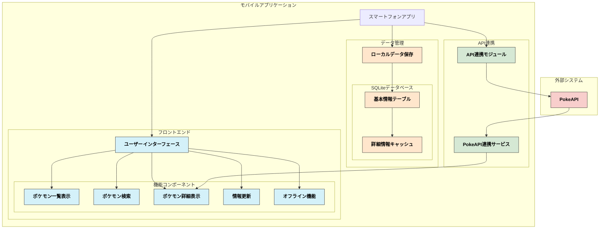

##### 2.1.2 アプリケーション機能構成図

以下のアプリケーション機能構成図は、ユーザーが利用する各機能がどのようにアプリケーション内でつながっているかを示しています。

- **ポケモン一覧表示機能**: ユーザーがポケモン一覧を表示し、検索・ソート・絞り込みができる機能。
- **ポケモン詳細表示機能**: ユーザーが特定のポケモンを選択し、その詳細情報（進化等）を表示する機能。
- **ポケモン情報更新機能**: ユーザーが最新のポケモン情報を手動で更新する機能や、アプリ起動時に自動的に情報が更新される機能。
- **オフライン機能**: インターネット接続なしでも基本的なポケモン情報を表示できる機能。

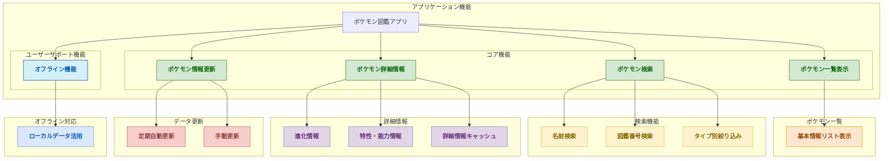

---

#### 2.2 画面設計

##### 2.2.1 画面一覧

| No. | **画面名** | **機能** | **操作内容** |
| --- | --- | --- | --- |
| 1 | **スプラッシュ画面** | ・ポケモン基本情報更新機能開始 | ・なし |
| 2 | **ポケモン一覧画面** | ・ポケモンのリスト表示<br>・検索機能<br>・ソート機能（図鑑番号順）<br>・タイプ別絞り込み機能 | ・ポケモンをリストからスクロールして選択<br>・名前または図鑑番号で検索<br>・図鑑番号でソート<br>・タイプで絞り込み |
| 3 | **ポケモン詳細画面** | ・ポケモンの詳細情報表示（進化情報、進化条件など）<br>・オフライン表示のためのキャッシュ機能 | ・進化等の情報を確認<br>・詳細はオフライン時でもキャッシュから閲覧可能 |
| 4 | **設定画面** | ・手動でのデータ更新 | ・データを手動で更新文字サイズ調整 |

##### 2.2.2 画面遷移図

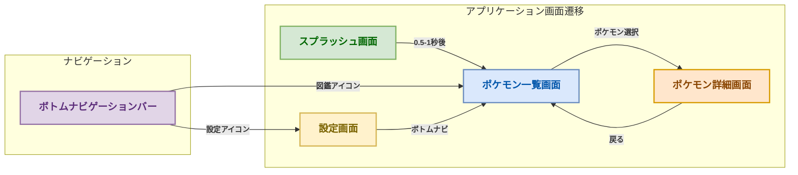

###### 画面遷移説明

スプラッシュ画面:
アプリ起動後始めに表示される画面。
ポケモン基本情報更新機能を開始する。
表示時間は0.5秒〜1秒に収まるようにし、更新が終わるか関係なく「ポケモン一覧画面」に遷移する。

ポケモン一覧画面:
「ポケモン一覧画面」からは、選択したポケモンの詳細情報を表示するために「ポケモン詳細画面」へ遷移できます。
また、ボトムナビゲーションバーを使って、「設定画面」へ遷移できます。

ポケモン詳細画面:
ユーザーはポケモンの詳細情報を確認後、ヘッダーの戻るボタンか戻るジェスチャーを使用して「ポケモン一覧画面」へ戻ることができます。
詳細情報は自動的にキャッシュされ、最後に閲覧した10件はオフラインでも参照可能です。

設定画面:
ユーザーは「設定画面」で手動でデータ更新ができます。
設定画面からもボトムナビゲーションバーを使用して「ポケモン一覧画面」に遷移可能です。

##### 2.2.3 画面レイアウト

以下を参照

[Figma: ポケモン図鑑(カントー地方)デザイン](https://www.figma.com/design/b0kI8aTikCubCeKQdcSKEC/%E3%83%9D%E3%82%B1%E3%83%A2%E3%83%B3%E5%9B%B3%E9%91%91%28%E3%82%AB%E3%83%B3%E3%83%88%E3%83%BC%E5%9C%B0%E6%96%B9%29%E3%83%87%E3%82%B6%E3%82%A4%E3%83%B3?node-id=3-40&t=c3mklPkvnhvy8Sp5-1)

---

#### 2.3 外部インターフェース設計

外部インターフェース設計では、アプリが他のシステムとどのように通信するかを詳細に定義します。
このアプリでは、外部インターフェースとして PokeAPI を使用してポケモン情報を取得します。

##### 2.3.1 外部システム関連図

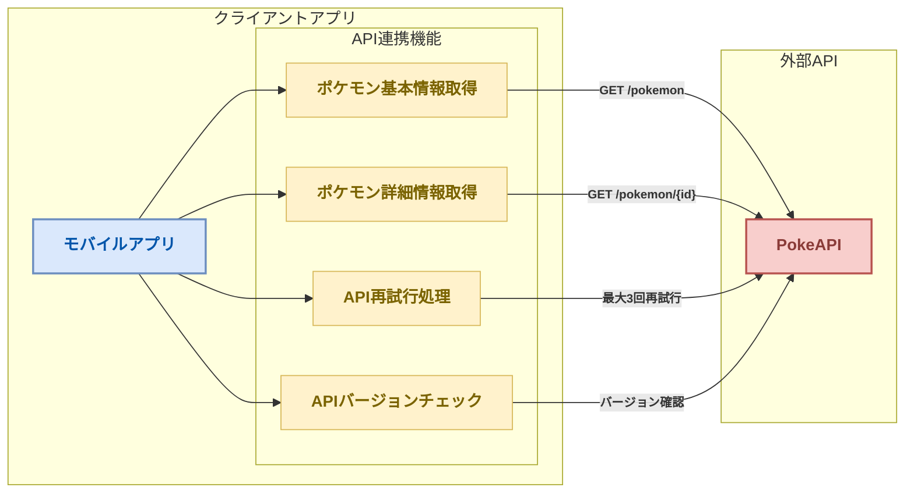

###### 外部システム関連図説明

モバイルアプリ:
ユーザーが操作するアプリ部分。
PokeAPIと連携してデータを取得、更新します。また、API障害時の再試行やバージョンチェックも行います。

PokeAPI:
外部APIで、ポケモン情報（基本データや詳細情報）を提供します。

##### 2.3.2 外部インターフェース一覧

| No. | **インターフェース名** | **インターフェースの種類** | **外部システム名** | **利用目的** | **インターフェース詳細** |
| --- | --- | --- | --- | --- | --- |
| 1 | **PokeAPI** | RESTful API | PokeAPI | ポケモン情報の取得（基本データ、進化情報など） | ・ポケモンの基本データ（番号、名前、タイプ、進化情報など）を取得する。<br>・リクエストはHTTPSで行い、レスポンスをJSON形式で受け取る。<br>・最大3回まで30秒間隔で再試行し、API障害に備える。 |

###### 外部インターフェース説明

1. **PokeAPI**:
    - 外部のポケモン情報を提供するAPI。モバイルアプリがポケモンの基本情報や進化情報などを取得するために利用します。
    - 通信はすべてHTTPSで行い、証明書ピン留めによる中間者攻撃防止を実装します。
    - API仕様変更検出のためバージョン情報を確認し、必要に応じてアップデートを促す仕組みを実装します。
    - 取得失敗時は最大3回まで30秒間隔で自動的に再試行します。

##### 2.3.3 外部インターフェース定義

**1. PokeAPI**

以下を参照
Swaggerで作成する

###### エラー処理

PokeAPIを利用する際のエラー処理は、以下の通り定義します。

1. **ネットワークエラー**
    - **原因**: ネットワークの接続不良、タイムアウトなど。
    - **対応方法**:
        - ユーザーに「ネットワーク接続を確認してください」というメッセージを表示。
        - 再試行ボタンを提供し、最大3回まで30秒間隔で自動的に再試行を行う。
        - リトライ後も失敗した場合は、オフラインモードに切り替えるか、キャッシュされたデータを表示。
2. **APIレスポンスエラー**
    - **原因**: APIからのレスポンスが異常、ステータスコードがエラー（例: 500, 404）など。
    - **対応方法**:
        - エラーメッセージをユーザーに表示。
        - リトライオプションの提供。
        - 最大3回まで30秒間隔で自動的に再試行を行う。
        - 10件までのキャッシュされた詳細情報を提供。
3. **不正なデータエラー**
    - **原因**: APIからのレスポンスが期待される形式ではない（JSON解析エラーなど）。
    - **対応方法**:
        - ユーザーには「データの取得に失敗しました」と表示。
        - ログを記録し、開発者にフィードバックする。
        - キャッシュされたデータがある場合は表示し、その旨をユーザーに通知。

---

#### 2.4 内部インターフェース定義

##### 2.4.1 内部システム関連図

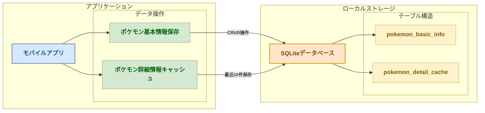

###### 内部システム関連図説明

モバイルアプリ:
ユーザーが操作するアプリ部分。
PokeAPIから取得したデータをSQLiteに保存、取得します。また、最近閲覧した詳細情報のキャッシュも行います。

SQLite:
SQLiteは軽量で自己完結型のローカルデータベース管理システム。

##### 2.4.2 内部インターフェース一覧

| No. | **インターフェース名** | **インターフェースの種類** | **内部システム名** | **利用目的** | **インターフェース詳細** |
| --- | --- | --- | --- | --- | --- |
| 1 | **SQLite** | ローカルデータベース | SQLite | ポケモンの基本情報の保存とキャッシュ | ・保存: ユーザーが取得したポケモン情報をローカルデータベースに保存<br>・取得: ローカルデータベースからポケモン情報を取得<br>・キャッシュ: 最近閲覧した10件の詳細情報を保存 |

**内部インターフェース説明**

1. **SQLite**:
    - SQLiteは軽量で自己完結型のローカルデータベース管理システムで、外部サーバーと接続せずにデータベースをローカル環境内で直接操作できます。
    - ポケモンの基本情報（ポケモンの図鑑番号、画像、名前、タイプ）をデバイス内に保存し、ユーザーが獲得したポケモンデータを効率的に管理するために使用されます。
    - 最近閲覧した10件のポケモン詳細情報をキャッシュとして保存し、オフライン時でも参照可能にします。
    - ユーザー設定情報を暗号化して保存し、セキュリティを確保します。
    - データ保存容量は初期状態で約10MB以内に収めます。

##### 2.4.3 テーブル構成

**1. テーブル名: pokemon_basic_info**

| カラム名 | データ型 | 説明 |
| --- | --- | --- |
| **id** | `INT` （自動インクリメント） | 主キー。ポケモンの一意識別用。 |
| **pokedex_number** | `INT` | ポケモンの図鑑番号（例：001, 002, ...）。ユニーク制約。 |
| **name** | `VARCHAR(255)` | ポケモンの名前（例：ピカチュウ、リザードン）。 |
| **type_1** | `VARCHAR(50)` | 主タイプ（例：でんき、ほのお、みず）。 |
| **type_2** | `VARCHAR(50)` | サブタイプ（例：ふゆう、ひこう）。NULLも許容。 |
| **image_url** | `VARCHAR(255)` | ポケモンの画像URL（外部リンク）。 |
| **last_updated** | `TIMESTAMP` | 最終更新日時。データ鮮度の確認用。 |

**2. テーブル名: pokemon_detail_cache**

| カラム名 | データ型 | 説明 |
| --- | --- | --- |
| **id** | `INT` （自動インクリメント） | 主キー。キャッシュエントリの一意識別用。 |
| **pokedex_number** | `INT` | ポケモンの図鑑番号。pokemon_basic_infoの外部キー。 |
| **evolution_chain** | `TEXT` | 進化情報をJSON形式で保存。 |
| **moves** | `TEXT` | 技情報をJSON形式で保存。 |
| **last_viewed** | `TIMESTAMP` | 最後に閲覧した日時。古いキャッシュ削除用。 |
| **cached_on** | `TIMESTAMP` | キャッシュした日時。データ鮮度の確認用。 |

---

#### 2.5 パフォーマンス設計

パフォーマンス設計では、アプリが効率的に動作するための性能基準を定義します。

##### 2.5.1 パフォーマンス目標

| 項目 | 目標値 | 説明 |
| --- | --- | --- |
| **画面遷移時間** | 300ms以内 | 画面間の遷移にかかる時間 |
| **データ読み込み時間** | 2秒以内 | 通常のネットワーク環境下でのデータ読み込み時間 |
| **アプリサイズ** | 30MB以下 | 初期インストール時のアプリケーションサイズ |
| **メモリ使用量** | 100MB以下 | アプリケーション実行時の最大メモリ使用量 |
| **ローカルストレージ使用量** | 10MB以内 | アプリケーションのローカルストレージ使用量（初期状態） |

##### 2.5.2 最適化戦略

1. **イメージの最適化**
    - ポケモン画像はキャッシュし、再読み込みを最小限に抑える
    - 適切な解像度とフォーマットを使用し、ファイルサイズを小さく保つ
2. **データ取得の最適化**
    - 一覧表示に必要な最小限のデータのみを最初に取得
    - 詳細データは必要に応じて遅延読み込み
3. **キャッシュ戦略**
    - 最近閲覧した10件のポケモン詳細情報をキャッシュとして保存
    - 一覧データは完全にローカルに保存し、オフラインでも利用可能に

---

#### 2.6 テスト計画

##### 2.6.1 テスト種類と範囲

| テスト種類 | 説明 | 実施タイミング |
| --- | --- | --- |
| **ユニットテスト** | 各機能の個別コンポーネントのテスト | 開発中随時 |
| **統合テスト** | 複数のコンポーネントを組み合わせたテスト | 機能実装後 |
| **UI/UXテスト** | ユーザーインターフェースと操作性のテスト | プロトタイプ完成後 |
| **互換性テスト** | 様々な画面サイズとデバイスでの互換性テスト | ベータ版前 |
| **パフォーマンステスト** | 応答速度、メモリ使用量などのテスト | ベータ版前 |
| **セキュリティテスト** | データ保護機能、通信セキュリティのテスト | ベータ版前 |

##### 2.6.2 テストスケジュール

- プロトタイプ完成後2週間以内に内部テストを実施
- ベータ版公開1ヶ月前にユーザー受け入れテストを開始

---

#### 2.7 セキュリティ設計

##### 2.7.1 データ保護

1. **ローカルデータの暗号化**
    - ユーザーデータは端末内で暗号化して保存
    - SQLiteデータベースへのアクセス制限
2. **通信セキュリティ**
    - PokeAPIとの通信はすべてHTTPSで実施
    - 証明書ピン留めによる中間者攻撃防止

##### 2.7.2 セキュリティ対策

| 脅威 | 対策 |
| --- | --- |
| **データ漏洩** | データの暗号化保存、最小限の情報収集 |
| **中間者攻撃** | HTTPS通信、証明書ピン留め |
| **不正アクセス** | アプリ内データへのアクセス制限 |

---

#### 2.8 運用・保守計画

##### 2.8.1 バグ修正ポリシー

- 重大なバグは48時間以内に修正版をリリース
- 軽微なバグは2週間以内に修正版をリリース

##### 2.8.2 アップデート頻度

- 機能追加は3ヶ月ごとに実施
- バグ修正は必要に応じて随時実施

##### 2.8.3 サポート期間

- 正式リリースから最低2年間のサポートを提供

##### 2.8.4 ユーザーフィードバック収集

- ベータテスト期間中にユーザーからのフィードバックを収集するためのフォームを提供
- アプリ内からバグ報告や機能改善の提案を送信できる仕組みを実装

---

### 付録: 基本設計とは

> 設計工程そのものの解説です。アプリの仕様ではありません。

#### 開発プロジェクトとは

開発プロジェクトとは、ソフトウェアやシステムを作成するための組織的な取り組みです。これは単にプログラムを書くだけではなく、計画から実装、テスト、リリースまでの全工程を含みます。

#### 基本設計の位置づけ

基本設計（Basic Design）は、開発プロジェクトの初期段階で行われる重要なプロセスです。これは要件定義の後に行われ、システムの骨組みを決定する段階です。

#### 基本設計のプロセス

##### 1. 要件の確認

まず、顧客やユーザーの要望（要件）を十分に理解することから始めます。これにより、作るべきものの目的や機能が明確になります。

##### 2. システム全体の構造決定

システムをどのように構成するかの大枠を決めます。例えば、ウェブアプリケーションであれば、フロントエンド（見た目の部分）とバックエンド（裏側で動く部分）の分離などを決定します。

##### 3. データ設計

システムで扱うデータの種類と構造を決めます。データベースを使用する場合は、テーブル設計や関連性の定義も行います。

##### 4. インターフェース設計

システムの利用者がどのように操作するか、また他のシステムとどのように連携するかを決めます。画面のレイアウトや機能配置なども含まれます。

##### 5. セキュリティ設計

情報漏洩やシステム障害を防ぐための対策を計画します。ユーザー認証やデータ暗号化などの方法を決定します。

#### 基本設計の成果物

基本設計の結果として、以下のような文書が作成されます：

- システム構成図：システム全体の構造を視覚的に表現したもの
- 画面設計書：ユーザーインターフェースの詳細
- データベース設計書：データの保存方法や関連性の詳細
- 外部インターフェース仕様書：他システムとの連携方法

#### 基本設計の重要性

基本設計は後工程の詳細設計や実装の基盤となるため、ここでの判断ミスは後の大幅な修正につながる可能性があります。そのため、十分な検討と関係者間での合意形成が重要です。

#### まとめ

基本設計とは、開発プロジェクトにおいて「何を」「どのように」作るかの骨組みを決める重要なプロセスです。明確で適切な基本設計があれば、後の工程がスムーズに進み、品質の高いシステムを効率的に開発することができます。

---

## 詳細設計書 — ポケモン図鑑アプリ（カントー地方）

### はじめに

この詳細設計書は、[要件定義](01_要件定義.md)と[基本設計](02_基本設計.md)に基づき、そのまま実装に着手できる粒度まで設計を具体化したものです。

コード例は **Kotlin + Jetpack Compose** で記載しています。そのまま貼って動くものではなく、
設計の意図を伝えるためのスケッチです。import 文とテーマ定義は省略しています。

次のものは意図的に省いています。各 Issue で自分で実装してください。

- DTO からモデル・Entity への変換（`toEntity()` / `toDetail()`）
- 見た目を決める Composable（`PokemonGridItem` / `SearchField` / `LoadingIndicator`）
- 画面遷移の定義（`PokedexNavHost`）

実装するスコープと評価の基準は[実装仕様](04_実装仕様.md)、
作業の単位は[課題Issue一覧](課題Issue一覧.md)にまとめてあります。

#### 設計原則

- **レイヤードアーキテクチャ**: Presentation / Business / Data / Infrastructure の4層構成
- **SOLID原則**: 保守性と拡張性を重視した設計
- **パフォーマンス最適化**: ユーザー体験を左右する応答性の確保
- **オフラインファースト**: ネットワーク状況に依存しない堅牢な設計

#### この文書の構成

1. 全体アーキテクチャ — レイヤー構成と主要コンポーネント
2. データ構造設計 — 型定義とSQLiteテーブル
3. API設計 — PokeAPIの利用仕様と内部インターフェース
4. 機能詳細設計 — 機能ごとのシーケンス図・実装例・エラーハンドリング
5. エラーハンドリング — 例外の分類と共通処理
6. パフォーマンス設計 — 目標値と最適化方針

---

---

### 1. 全体アーキテクチャ

#### 1.1 レイヤー構成

```
┌─────────────────────────────────────┐
│        Presentation Layer           │ ← Composable（*Screen）
├─────────────────────────────────────┤
│         Business Layer              │ ← ViewModel（状態と画面ロジック）
├─────────────────────────────────────┤
│         Data Layer                  │ ← Repository / UpdateService / DetailCache
├─────────────────────────────────────┤
│      Infrastructure Layer           │ ← PokeApiService / Room / NetworkMonitor
└─────────────────────────────────────┘
```

[実装仕様](04_実装仕様.md)では同じ構造を Android の慣用名で
「UI / ViewModel / Repository / Data Sources」と呼んでいます。対応は次のとおりです。

| 本書 | 実装仕様 | 実装上の型 |
| --- | --- | --- |
| Presentation | UI Layer | `@Composable fun *Screen` |
| Business | ViewModel Layer | `*ViewModel`（`StateFlow` で状態を公開） |
| Data | Repository Layer | `PokemonRepository` / `UpdateService` / `DetailCache` |
| Infrastructure | Data Sources Layer | `PokeApiService` / `PokemonDao` / `NetworkMonitor` |

#### 1.2 主要コンポーネント

| コンポーネント | 役割 | 層 |
| --- | --- | --- |
| `PokemonRepository` | API とローカルDBを束ね、画面に単一の入口を提供する | Data |
| `PokeApiService` | PokeAPI との通信（Retrofit インターフェース） | Infrastructure |
| `PokemonDao` / `AppDatabase` | Room によるローカル永続化 | Infrastructure |
| `DetailCache` | 詳細情報のキャッシュ（直近10件・LRU） | Data |
| `UpdateService` | 151匹ぶんの取得と再試行の制御 | Data |
| `NetworkMonitor` | ネットワーク状態の監視 | Infrastructure |
| `*ViewModel` | 画面ごとの状態保持（StateFlow で公開） | Business |
| `*Screen` | Composable による画面描画 | Presentation |

---

### 2. データ構造設計

#### 2.1 Pokemon基本情報

```kotlin
// domain/model/Pokemon.kt — 画面が扱うモデル
data class Pokemon(
    val id: Int,
    val name: String,        // 英語名。一覧APIから取得
    val nameJa: String?,     // 日本語名。pokemon-species から取得（Phase 2）
    val imageUrl: String?,
    val type1: String?,
    val type2: String?,
    val heightDm: Int,       // APIの生値（デシメートル）
    val weightHg: Int,       // APIの生値（ヘクトグラム）
) {
    val displayName: String get() = nameJa ?: name
    val heightMeters: Double get() = heightDm / 10.0   // 7 → 0.7 m
    val weightKg: Double get() = weightHg / 10.0       // 69 → 6.9 kg
    val types: List<String> get() = listOfNotNull(type1, type2)
}
```

```kotlin
// data/local/PokemonEntity.kt — Room の保存形式
@Entity(
    tableName = "pokemon",
    indices = [Index("name"), Index("name_ja"), Index("type1"), Index("type2")],
)
data class PokemonEntity(
    @PrimaryKey val id: Int,
    val name: String,
    @ColumnInfo(name = "name_ja") val nameJa: String? = null,
    @ColumnInfo(name = "image_url") val imageUrl: String? = null,
    val height: Int,
    val weight: Int,
    val type1: String? = null,
    val type2: String? = null,
    @ColumnInfo(name = "created_at") val createdAt: Long = System.currentTimeMillis(),
)

fun PokemonEntity.toDomain() = Pokemon(id, name, nameJa, imageUrl, type1, type2, height, weight)
```

#### 2.2 Pokemon詳細情報

```kotlin
// domain/model/PokemonDetail.kt
data class PokemonDetail(
    val pokemon: Pokemon,
    val abilities: List<Ability>,
    val stats: List<Stat>,
    val evolutions: List<Evolution>,
    val flavorTextJa: String?,   // pokemon-species の日本語説明文
)

data class Ability(
    val name: String,
    val isHidden: Boolean,       // 隠れ特性かどうか
)

data class Stat(
    val name: String,            // hp / attack / defense ...
    val value: Int,
) {
    companion object { const val MAX_VALUE = 255 }
}

data class Evolution(
    val fromId: Int,
    val toId: Int,
    val condition: String,       // 例: "レベル16"
)
```

#### 2.3 SQLiteテーブル設計

Room が生成するスキーマは次のとおりです。日付はエポックミリ秒（`INTEGER`）で保持します。

```sql
-- ポケモン基本情報
CREATE TABLE pokemon (
    id         INTEGER PRIMARY KEY,   -- 図鑑番号
    name       TEXT    NOT NULL,      -- 英語名
    name_ja    TEXT,                  -- 日本語名（Phase 2）
    image_url  TEXT,
    height     INTEGER,               -- デシメートル（APIの生値）
    weight     INTEGER,               -- ヘクトグラム（APIの生値）
    type1      TEXT,
    type2      TEXT,                  -- 単タイプのポケモンは NULL
    created_at INTEGER NOT NULL
);

CREATE INDEX idx_pokemon_name    ON pokemon(name);
CREATE INDEX idx_pokemon_name_ja ON pokemon(name_ja);
CREATE INDEX idx_pokemon_type1   ON pokemon(type1);
CREATE INDEX idx_pokemon_type2   ON pokemon(type2);

-- 詳細情報のキャッシュ（直近10件のみ保持）
CREATE TABLE pokemon_detail_cache (
    id            INTEGER PRIMARY KEY,
    detail_json   TEXT    NOT NULL,
    cached_at     INTEGER NOT NULL,
    last_accessed INTEGER NOT NULL,   -- LRU の判定に使う
    FOREIGN KEY (id) REFERENCES pokemon(id)
);

CREATE INDEX idx_cache_last_accessed ON pokemon_detail_cache(last_accessed);
```

タイプは `type1` / `type2` の個別カラムに分けています。
JSON配列で持つとタイプ検索が `LIKE` になりインデックスが効かないためです。

---

### 3. API設計

#### 3.1 PokeAPI エンドポイント仕様

##### 3.1.1 ポケモン一覧取得

```
GET https://pokeapi.co/api/v2/pokemon/?limit=151&offset=0
```

**レスポンス例:**

```json
{
  "count": 151,
  "results": [
    {
      "name": "bulbasaur",
      "url": "https://pokeapi.co/api/v2/pokemon/1/"
    }
  ]
}
```

##### 3.1.2 ポケモン詳細取得

```
GET https://pokeapi.co/api/v2/pokemon/{id}/
```

#### 3.2 内部API設計

##### 3.2.1 PokemonRepository Interface

```kotlin
// data/repository/PokemonRepository.kt
interface PokemonRepository {

    /** 一覧はローカルDBを唯一の情報源とする。DBが更新されれば画面へ自動的に流れる。 */
    fun observePokemonList(): Flow<List<Pokemon>>

    /** 検索も DB に対して行う。query が空なら全件を返す。 */
    fun searchPokemon(query: String): Flow<List<Pokemon>>

    /** 詳細は API から取得し、直近10件をキャッシュする。 */
    suspend fun getPokemonDetail(id: Int): Result<PokemonDetail>

    /** API から取得して DB を更新する。onProgress は (完了数, 総数)。 */
    suspend fun refresh(onProgress: (done: Int, total: Int) -> Unit = { _, _ -> }): Result<Unit>

    /** 最終更新日時（エポックミリ秒）。未更新なら null。 */
    suspend fun lastUpdatedAt(): Long?
}
```

---

### 4. 機能詳細設計

#### 4.1 アプリ起動・初期化機能

##### 4.1.1 機能概要

アプリ起動時にスプラッシュ画面を表示し、初期データ取得と画面遷移を行う。

##### 4.1.2 処理フロー

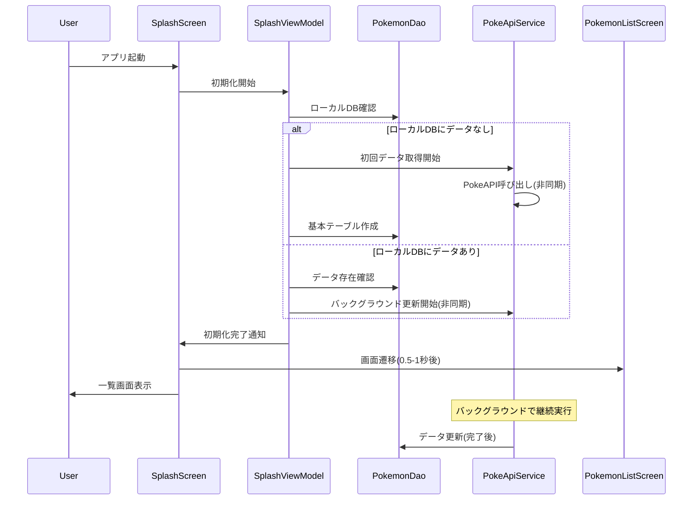

##### 4.1.3 実装仕様

###### SplashScreen（Composable）

```kotlin
// ui/splash/SplashScreen.kt
private const val MINIMUM_DISPLAY_MS = 500L   // 要件: 0.5〜1秒

@Composable
fun SplashScreen(
    onFinished: () -> Unit,
    viewModel: SplashViewModel = viewModel(factory = LocalAppContainer.current.viewModelFactory),
) {
    LaunchedEffect(Unit) {
        // 初期化の成否にかかわらず一覧へ進む。起動を止めないことを優先する。
        val elapsed = measureTimeMillis { viewModel.initialize() }
        delay((MINIMUM_DISPLAY_MS - elapsed).coerceAtLeast(0L))
        onFinished()
    }

    Box(Modifier.fillMaxSize(), contentAlignment = Alignment.Center) {
        Image(
            painter = painterResource(R.drawable.ic_pokedex),
            contentDescription = null,
        )
    }
}

class SplashViewModel(private val repository: PokemonRepository) : ViewModel() {
    suspend fun initialize() {
        repository.refresh()
            .onFailure { Log.w(TAG, "初期データの取得に失敗。保存済みデータで継続する", it) }
    }

    private companion object { const val TAG = "SplashViewModel" }
}
```

###### Application と依存の組み立て

```kotlin
// PokedexApplication.kt — アプリ全体の初期化と依存の組み立て
class PokedexApplication : Application() {
    lateinit var container: AppContainer
        private set

    override fun onCreate() {
        super.onCreate()
        container = AppContainer(this)
    }
}

/**
 * 手動DIのコンテナ。Hilt を導入する場合は @Module に置き換える。
 * Phase 1 はこの形で十分に動く。
 */
class AppContainer(context: Context) {

    private val json = Json { ignoreUnknownKeys = true }

    private val database = Room
        .databaseBuilder(context, AppDatabase::class.java, "pokedex.db")
        .fallbackToDestructiveMigration()   // 学習用途。データは API から取り直せる
        .build()

    private val okHttp = OkHttpClient.Builder()
        .addInterceptor(
            HttpLoggingInterceptor().apply {
                // リリースビルドではログを出さない
                level = if (BuildConfig.DEBUG) HttpLoggingInterceptor.Level.BODY
                        else HttpLoggingInterceptor.Level.NONE
            }
        )
        .build()

    private val api: PokeApiService = Retrofit.Builder()
        .baseUrl(PokeApiService.BASE_URL)
        .client(okHttp)
        .addConverterFactory(json.asConverterFactory("application/json".toMediaType()))
        .build()
        .create(PokeApiService::class.java)

    val networkMonitor = NetworkMonitor(context)

    val pokemonRepository: PokemonRepository = DefaultPokemonRepository(
        api = api,
        dao = database.pokemonDao(),
        detailCache = DetailCache(database.detailCacheDao(), json),
        networkMonitor = networkMonitor,
        updateService = UpdateService(api, database.pokemonDao()),
    )

    /** ViewModel に依存を渡すためのファクトリ */
    val viewModelFactory = viewModelFactory {
        initializer { SplashViewModel(pokemonRepository) }
        initializer { PokemonListViewModel(pokemonRepository, networkMonitor) }
        initializer { PokemonDetailViewModel(pokemonRepository) }
    }
}

/** Composable から AppContainer を引くための CompositionLocal */
val LocalAppContainer = staticCompositionLocalOf<AppContainer> {
    error("AppContainer が提供されていません")
}

// MainActivity の setContent で流し込む
setContent {
    CompositionLocalProvider(
        LocalAppContainer provides (application as PokedexApplication).container
    ) {
        PokedexTheme { PokedexNavHost() }
    }
}
```

---

#### 4.2 ポケモン一覧表示機能

##### 4.2.1 機能概要

カントー地方のポケモン151匹を一覧表示し、検索・絞り込み機能を提供する。

##### 4.2.2 処理フロー

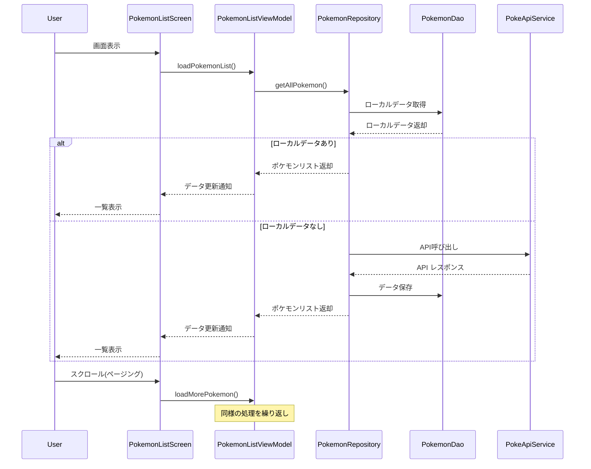

##### 4.2.3 実装仕様

###### PokemonListScreen（Composable）

```kotlin
// ui/list/PokemonListScreen.kt
@Composable
fun PokemonListScreen(
    onPokemonClick: (Int) -> Unit,
    viewModel: PokemonListViewModel = viewModel(factory = LocalAppContainer.current.viewModelFactory),
) {
    val uiState by viewModel.uiState.collectAsStateWithLifecycle()

    Column {
        OfflineBanner(visible = uiState.isOffline)

        SearchField(
            query = uiState.query,
            onQueryChange = viewModel::onQueryChange,
        )

        PullToRefreshBox(
            isRefreshing = uiState.isRefreshing,
            onRefresh = viewModel::refresh,
        ) {
            // LazyVerticalGrid は画面に見えているセルだけを構成するため、
            // 151件をそのまま渡してよい。手動のページングは不要。
            LazyVerticalGrid(
                columns = GridCells.Fixed(2),
                contentPadding = PaddingValues(8.dp),
                verticalArrangement = Arrangement.spacedBy(8.dp),
                horizontalArrangement = Arrangement.spacedBy(8.dp),
            ) {
                items(uiState.pokemonList, key = { it.id }) { pokemon ->
                    PokemonGridItem(
                        pokemon = pokemon,
                        onClick = { onPokemonClick(pokemon.id) },
                    )
                }
            }
        }
    }
}
```

###### PokemonListViewModel

```kotlin
// ui/list/PokemonListViewModel.kt
data class PokemonListUiState(
    val pokemonList: List<Pokemon> = emptyList(),
    val query: String = "",
    val isRefreshing: Boolean = false,
    val isOffline: Boolean = false,
    val errorMessage: String? = null,
) {
    val isEmpty: Boolean get() = pokemonList.isEmpty() && query.isNotBlank()
}

@OptIn(FlowPreview::class, ExperimentalCoroutinesApi::class)
class PokemonListViewModel(
    private val repository: PokemonRepository,
    networkMonitor: NetworkMonitor,
) : ViewModel() {

    private val query = MutableStateFlow("")
    private val isRefreshing = MutableStateFlow(false)
    private val errorMessage = MutableStateFlow<String?>(null)

    private val pokemonList = query
        .debounce(300)              // 入力のたびに検索が走らないようにする
        .distinctUntilChanged()
        .flatMapLatest { repository.searchPokemon(it) }   // 前の検索は自動的に打ち切られる

    val uiState: StateFlow<PokemonListUiState> = combine(
        pokemonList, query, isRefreshing, networkMonitor.isOnline, errorMessage,
    ) { list, q, refreshing, online, error ->
        PokemonListUiState(list, q, refreshing, isOffline = !online, errorMessage = error)
    }.stateIn(
        scope = viewModelScope,
        started = SharingStarted.WhileSubscribed(5_000),   // 画面回転では購読を切らない
        initialValue = PokemonListUiState(),
    )

    fun onQueryChange(text: String) { query.value = text }

    fun refresh() {
        viewModelScope.launch {
            isRefreshing.value = true
            errorMessage.value = null
            repository.refresh().onFailure { errorMessage.value = it.toUserMessage() }
            isRefreshing.value = false
        }
    }

    fun consumeError() { errorMessage.value = null }
}
```

---

#### 4.3 ポケモン検索機能

##### 4.3.1 機能概要

名前、図鑑番号、タイプによるポケモン検索機能を提供する。

##### 4.3.2 処理フロー

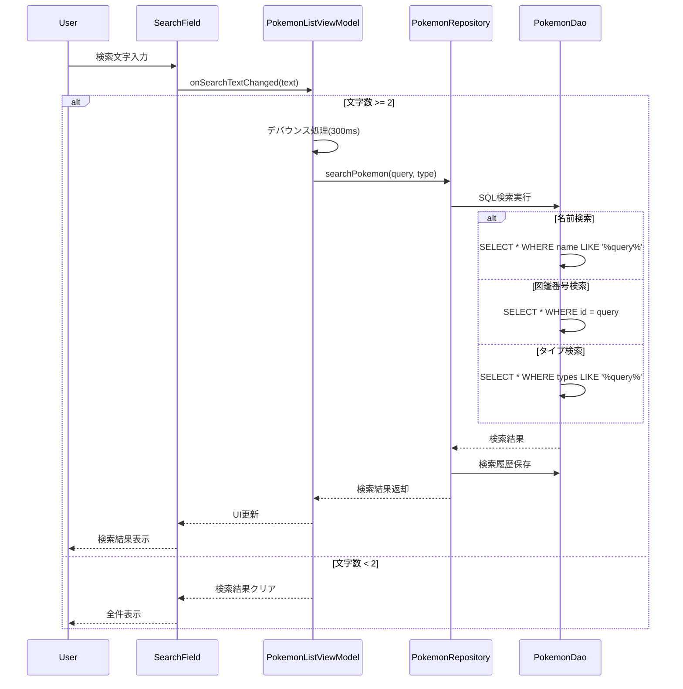

##### 4.3.3 実装仕様

###### 検索の状態管理

```kotlin
// 検索は一覧画面の ViewModel に統合する。専用の ViewModel は作らない。
// 入力文字列から検索の種類を判定し、DAO のクエリを使い分ける。

enum class SearchType { ID, TYPE, NAME }

/** ポケモンのタイプ名（PokeAPI の英語表記） */
val POKEMON_TYPES = setOf(
    "normal", "fire", "water", "electric", "grass", "ice", "fighting", "poison",
    "ground", "flying", "psychic", "bug", "rock", "ghost", "dragon", "dark", "steel", "fairy",
)

fun detectSearchType(query: String): SearchType = when {
    query.toIntOrNull() != null -> SearchType.ID
    query.lowercase() in POKEMON_TYPES -> SearchType.TYPE
    else -> SearchType.NAME
}

// ViewModel 側でのデバウンス（PokemonListViewModel から抜粋）
private val pokemonList = query
    .debounce(300)                                    // 300ms 入力が止まってから検索する
    .distinctUntilChanged()                           // 同じ文字列で二重に検索しない
    .flatMapLatest { repository.searchPokemon(it) }   // 新しい入力が来たら前の検索は破棄
```

###### PokemonRepository 検索実装

```kotlin
// data/local/PokemonDao.kt — 検索は SQL に任せる（インデックスが効く）
@Dao
interface PokemonDao {

    @Query("SELECT * FROM pokemon ORDER BY id")
    fun observeAll(): Flow<List<PokemonEntity>>

    @Query("SELECT * FROM pokemon WHERE id = :id")
    fun observeById(id: Int): Flow<List<PokemonEntity>>

    // SQLite の LIKE は ASCII について大文字小文字を区別しない
    @Query(
        """
        SELECT * FROM pokemon
        WHERE name LIKE '%' || :query || '%'
           OR name_ja LIKE '%' || :query || '%'
        ORDER BY id
        """
    )
    fun searchByName(query: String): Flow<List<PokemonEntity>>

    @Query("SELECT * FROM pokemon WHERE type1 = :type OR type2 = :type ORDER BY id")
    fun searchByType(type: String): Flow<List<PokemonEntity>>

    @Upsert
    suspend fun upsertAll(pokemon: List<PokemonEntity>)

    @Query("SELECT COUNT(*) FROM pokemon")
    suspend fun count(): Int

    @Query("SELECT MAX(created_at) FROM pokemon")
    suspend fun latestCreatedAt(): Long?
}

// data/repository/DefaultPokemonRepository.kt
override fun searchPokemon(query: String): Flow<List<Pokemon>> {
    val trimmed = query.trim()
    val source = when {
        trimmed.isEmpty() -> dao.observeAll()
        else -> when (detectSearchType(trimmed)) {
            SearchType.ID -> dao.observeById(trimmed.toInt())
            SearchType.TYPE -> dao.searchByType(trimmed.lowercase())
            SearchType.NAME -> dao.searchByName(trimmed)
        }
    }
    return source.map { entities -> entities.map { it.toDomain() } }
}
```

---

#### 4.4 ポケモン詳細表示機能

##### 4.4.1 機能概要

選択されたポケモンの詳細情報（進化、特性、能力値等）を表示する。

##### 4.4.2 処理フロー

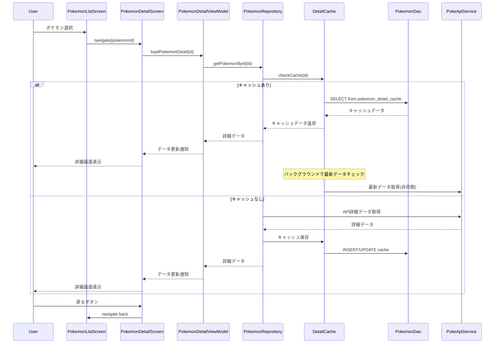

##### 4.4.3 実装仕様

###### PokemonDetailScreen（Composable）

```kotlin
// ui/detail/PokemonDetailScreen.kt
@Composable
fun PokemonDetailScreen(
    pokemonId: Int,
    onBack: () -> Unit,
    viewModel: PokemonDetailViewModel = viewModel(factory = LocalAppContainer.current.viewModelFactory),
) {
    val uiState by viewModel.uiState.collectAsStateWithLifecycle()

    LaunchedEffect(pokemonId) { viewModel.load(pokemonId) }

    Scaffold(
        topBar = {
            TopAppBar(
                title = { Text((uiState as? DetailUiState.Success)?.detail?.pokemon?.displayName.orEmpty()) },
                navigationIcon = {
                    IconButton(onClick = onBack) {
                        Icon(Icons.AutoMirrored.Filled.ArrowBack, contentDescription = "戻る")
                    }
                },
            )
        },
    ) { padding ->
        when (val state = uiState) {
            DetailUiState.Loading -> LoadingIndicator(Modifier.padding(padding))
            is DetailUiState.Error -> ErrorMessage(
                message = state.message,
                onRetry = { viewModel.load(pokemonId) },
                modifier = Modifier.padding(padding),
            )
            is DetailUiState.Success -> DetailContent(state.detail, Modifier.padding(padding))
        }
    }
}

@Composable
private fun DetailContent(detail: PokemonDetail, modifier: Modifier = Modifier) {
    Column(modifier.verticalScroll(rememberScrollState())) {
        PokemonImage(detail.pokemon)
        BasicInfoSection(detail.pokemon)        // 図鑑番号・タイプ・身長・体重
        AbilitiesSection(detail.abilities)      // Phase 2
        if (detail.evolutions.isNotEmpty()) {   // 進化しないポケモンでは表示しない
            EvolutionSection(detail.evolutions)
        }
    }
}
```

###### PokemonDetailViewModel

```kotlin
// ui/detail/PokemonDetailViewModel.kt
sealed interface DetailUiState {
    data object Loading : DetailUiState
    data class Success(val detail: PokemonDetail) : DetailUiState
    data class Error(val message: String) : DetailUiState
}

class PokemonDetailViewModel(private val repository: PokemonRepository) : ViewModel() {

    private val _uiState = MutableStateFlow<DetailUiState>(DetailUiState.Loading)
    val uiState: StateFlow<DetailUiState> = _uiState.asStateFlow()

    fun load(id: Int) {
        viewModelScope.launch {
            _uiState.value = DetailUiState.Loading
            _uiState.value = repository.getPokemonDetail(id).fold(
                onSuccess = { DetailUiState.Success(it) },
                onFailure = { DetailUiState.Error(it.toUserMessage()) },
            )
        }
    }
}
```

###### 詳細情報のキャッシュ

```kotlin
// data/local/DetailCache.kt — 最後に閲覧した10件だけを保持する
@Entity(tableName = "pokemon_detail_cache", indices = [Index("last_accessed")])
data class PokemonDetailCacheEntity(
    @PrimaryKey val id: Int,
    @ColumnInfo(name = "detail_json") val detailJson: String,
    @ColumnInfo(name = "cached_at") val cachedAt: Long,
    @ColumnInfo(name = "last_accessed") val lastAccessed: Long,
)

@Dao
interface DetailCacheDao {

    @Query("SELECT * FROM pokemon_detail_cache WHERE id = :id")
    suspend fun find(id: Int): PokemonDetailCacheEntity?

    @Query("UPDATE pokemon_detail_cache SET last_accessed = :now WHERE id = :id")
    suspend fun touch(id: Int, now: Long)

    @Upsert
    suspend fun upsert(entity: PokemonDetailCacheEntity)

    @Query("DELETE FROM pokemon_detail_cache WHERE id = :id")
    suspend fun delete(id: Int)

    /** 直近アクセス順に :keep 件だけ残し、あふれたぶんを消す */
    @Query(
        """
        DELETE FROM pokemon_detail_cache
        WHERE id NOT IN (
            SELECT id FROM pokemon_detail_cache ORDER BY last_accessed DESC LIMIT :keep
        )
        """
    )
    suspend fun trimTo(keep: Int)
}

class DetailCache(
    private val dao: DetailCacheDao,
    private val json: Json,
) {
    suspend fun get(id: Int): PokemonDetail? {
        val row = dao.find(id) ?: return null

        // 24時間を過ぎたキャッシュは使わない
        if (System.currentTimeMillis() - row.cachedAt > EXPIRY_MS) {
            dao.delete(id)
            return null
        }

        dao.touch(id, System.currentTimeMillis())   // LRU の順序を更新
        return json.decodeFromString(row.detailJson)
    }

    suspend fun put(id: Int, detail: PokemonDetail) {
        val now = System.currentTimeMillis()
        dao.upsert(PokemonDetailCacheEntity(id, json.encodeToString(detail), now, now))
        dao.trimTo(MAX_ENTRIES)
    }

    private companion object {
        const val MAX_ENTRIES = 10                      // 要件: 最後に閲覧した10件
        val EXPIRY_MS = 24.hours.inWholeMilliseconds
    }
}
```

---

#### 4.5 データ更新機能

##### 4.5.1 機能概要

PokeAPIから最新のポケモンデータを取得し、ローカルデータベースを更新する。

##### 4.5.2 処理フロー

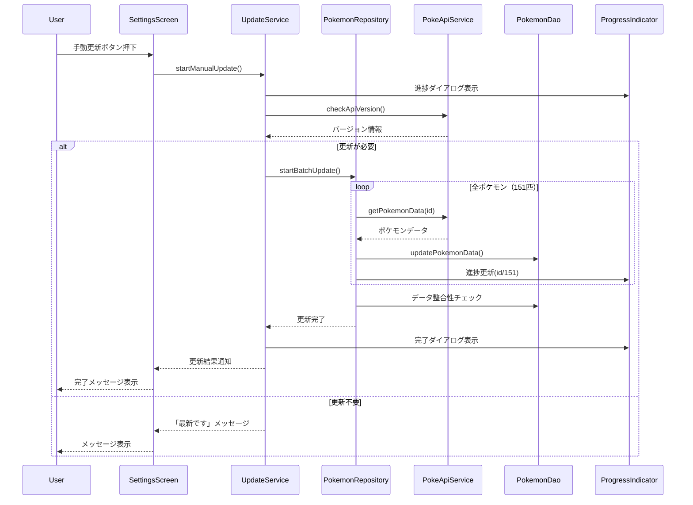

##### 4.5.3 実装仕様

###### UpdateService

```kotlin
// data/repository/UpdateService.kt
data class UpdateResult(val updated: Int, val failed: Int)

class UpdateService(
    private val api: PokeApiService,
    private val dao: PokemonDao,
) {
    private val mutex = Mutex()   // 手動更新と自動更新の二重起動を防ぐ

    /**
     * 151匹ぶんの詳細を取得して DB に保存する。
     *
     * 一覧APIはタイプ・身長・体重を返さないため、1匹ずつ詳細APIを叩く必要がある。
     * 逐次実行すると数分かかるので、同時実行数を CONCURRENCY に制限した並列取得にする。
     */
    suspend fun update(onProgress: (done: Int, total: Int) -> Unit = { _, _ -> }): UpdateResult =
        mutex.withLock {
            val total = KANTO_POKEMON_COUNT
            val done = AtomicInteger(0)
            val semaphore = Semaphore(CONCURRENCY)

            val results = coroutineScope {
                (1..total).map { id ->
                    async(Dispatchers.IO) {
                        semaphore.withPermit {
                            runCatching { fetchWithRetry(id) }
                                .also { onProgress(done.incrementAndGet(), total) }
                        }
                    }
                }.awaitAll()
            }

            // 取得できたぶんだけ保存する。途中で失敗しても次回に持ち越せる
            val fetched = results.mapNotNull { it.getOrNull() }
            dao.upsertAll(fetched)

            UpdateResult(updated = fetched.size, failed = results.count { it.isFailure })
        }

    /**
     * 要件定義の再試行ポリシー: 最大3回・30秒間隔。
     * 手動更新でユーザーを待たせたくない場合は、指数バックオフに変えてもよい。
     */
    private suspend fun fetchWithRetry(id: Int): PokemonEntity {
        var lastError: Throwable? = null
        repeat(MAX_RETRIES) { attempt ->
            try {
                return api.getPokemon(id).toEntity()
            } catch (e: IOException) {
                lastError = e
                if (attempt < MAX_RETRIES - 1) delay(RETRY_INTERVAL_MS)
            }
        }
        throw lastError ?: IllegalStateException("取得に失敗しました: id=$id")
    }

    private companion object {
        const val KANTO_POKEMON_COUNT = 151
        const val CONCURRENCY = 10          // PokeAPI のフェアユースに配慮する
        const val MAX_RETRIES = 3
        const val RETRY_INTERVAL_MS = 30_000L
    }
}
```

###### 自動更新の判定

```kotlin
// data/repository/AutoUpdatePolicy.kt
/**
 * 要件: 端末ローカル時間で午前10時を過ぎており、その日まだ更新していなければ
 * アプリ起動時に自動更新する。更新は1日1回（成功した場合のみ）。
 *
 * 成功時だけ日付を記録するため、失敗した日は次回の起動で再試行される。
 */
class AutoUpdatePolicy(private val prefs: DataStore<Preferences>) {

    suspend fun shouldUpdate(now: LocalDateTime = LocalDateTime.now()): Boolean {
        if (now.toLocalTime() < UPDATE_AFTER) return false
        val last = lastSuccessDate()
        return last == null || last < now.toLocalDate()
    }

    suspend fun recordSuccess(date: LocalDate = LocalDate.now()) {
        prefs.edit { it[LAST_SUCCESS] = date.toString() }
    }

    private suspend fun lastSuccessDate(): LocalDate? =
        prefs.data.first()[LAST_SUCCESS]?.let(LocalDate::parse)

    private companion object {
        val UPDATE_AFTER: LocalTime = LocalTime.of(10, 0)
        val LAST_SUCCESS = stringPreferencesKey("last_update_success_date")
    }
}

// MainActivity — アプリがフォアグラウンドに来たときに判定する
@Composable
fun AutoUpdateEffect(policy: AutoUpdatePolicy, repository: PokemonRepository) {
    val lifecycleOwner = LocalLifecycleOwner.current
    LaunchedEffect(lifecycleOwner) {
        lifecycleOwner.repeatOnLifecycle(Lifecycle.State.STARTED) {
            if (policy.shouldUpdate()) {
                repository.refresh().onSuccess { policy.recordSuccess() }
            }
        }
    }
}
```

---

#### 4.6 オフライン機能

##### 4.6.1 機能概要

ネットワーク接続がない場合でも、ローカルに保存されたデータでアプリを使用可能にする。

##### 4.6.2 処理フロー

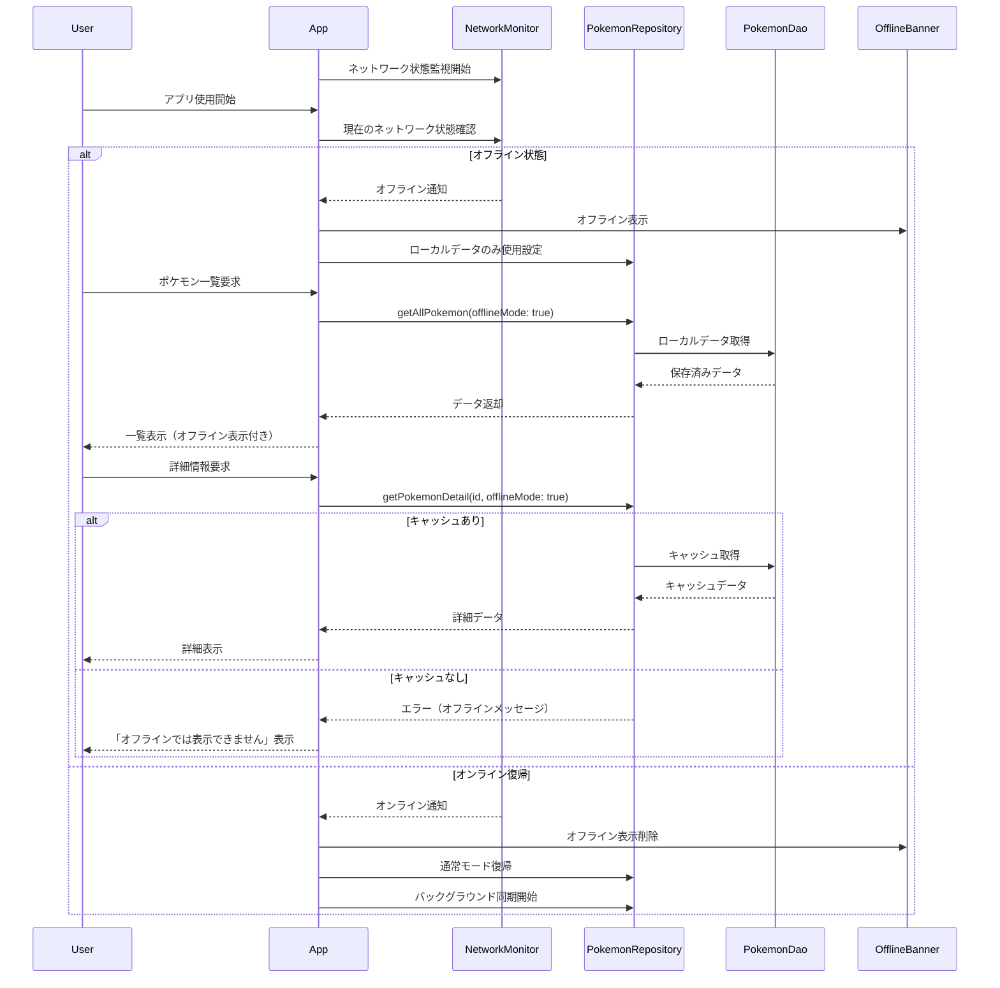

##### 4.6.3 実装仕様

###### NetworkMonitor

```kotlin
// data/NetworkMonitor.kt
// AndroidManifest.xml に <uses-permission android:name="android.permission.ACCESS_NETWORK_STATE"/> が必要
class NetworkMonitor(context: Context) {

    private val connectivityManager = context.getSystemService(ConnectivityManager::class.java)

    /** 接続状態の変化を Flow で流す。購読が切れたらコールバックを解除する。 */
    val isOnline: Flow<Boolean> = callbackFlow {
        val callback = object : ConnectivityManager.NetworkCallback() {
            override fun onAvailable(network: Network) { trySend(currentlyOnline()) }
            override fun onLost(network: Network) { trySend(currentlyOnline()) }
            override fun onCapabilitiesChanged(network: Network, caps: NetworkCapabilities) {
                trySend(caps.hasCapability(NetworkCapabilities.NET_CAPABILITY_VALIDATED))
            }
        }

        val request = NetworkRequest.Builder()
            .addCapability(NetworkCapabilities.NET_CAPABILITY_INTERNET)
            .build()

        connectivityManager.registerNetworkCallback(request, callback)
        trySend(currentlyOnline())   // 現在の状態を最初に流す

        awaitClose { connectivityManager.unregisterNetworkCallback(callback) }
    }.distinctUntilChanged().conflate()

    /** 「接続済み」ではなく「実際に通信できる」かを見る */
    private fun currentlyOnline(): Boolean {
        val caps = connectivityManager.getNetworkCapabilities(connectivityManager.activeNetwork)
        return caps?.hasCapability(NetworkCapabilities.NET_CAPABILITY_VALIDATED) == true
    }
}
```

###### オフライン対応 Repository

```kotlin
// data/repository/DefaultPokemonRepository.kt
class DefaultPokemonRepository(
    private val api: PokeApiService,
    private val dao: PokemonDao,
    private val detailCache: DetailCache,
    private val networkMonitor: NetworkMonitor,
    private val updateService: UpdateService,
) : PokemonRepository {

    /**
     * ローカルDBが唯一の情報源。API の結果は DB を経由して画面に届く。
     * 画面はオンライン・オフラインを意識しなくてよい。
     */
    override fun observePokemonList(): Flow<List<Pokemon>> =
        dao.observeAll().map { list -> list.map { it.toDomain() } }

    override suspend fun refresh(onProgress: (Int, Int) -> Unit): Result<Unit> {
        if (!networkMonitor.isOnline.first()) {
            return Result.failure(OfflineException())
        }
        return runCatching { updateService.update(onProgress) }.map { }
    }

    override suspend fun getPokemonDetail(id: Int): Result<PokemonDetail> {
        // キャッシュがあればオフラインでも表示できる
        detailCache.get(id)?.let { return Result.success(it) }

        if (!networkMonitor.isOnline.first()) {
            return Result.failure(
                OfflineException("オフラインのため、このポケモンの詳細は表示できません")
            )
        }

        return apiCall { api.getPokemon(id).toDetail() }
            .onSuccess { detailCache.put(id, it) }
    }

    override suspend fun lastUpdatedAt(): Long? = dao.latestCreatedAt()
}
```

###### OfflineBanner（Composable）

```kotlin
// ui/component/OfflineBanner.kt
@Composable
fun OfflineBanner(visible: Boolean, modifier: Modifier = Modifier) {
    AnimatedVisibility(
        visible = visible,
        enter = expandVertically(),
        exit = shrinkVertically(),
        modifier = modifier,
    ) {
        Surface(
            color = MaterialTheme.colorScheme.errorContainer,
            modifier = Modifier.fillMaxWidth(),
        ) {
            Row(
                verticalAlignment = Alignment.CenterVertically,
                modifier = Modifier.padding(horizontal = 16.dp, vertical = 8.dp),
            ) {
                Icon(
                    // CloudOff は material-icons-extended が必要。core に含まれる Warning で代用する
                    imageVector = Icons.Filled.Warning,
                    contentDescription = null,
                    tint = MaterialTheme.colorScheme.onErrorContainer,
                )
                Spacer(Modifier.width(8.dp))
                Text(
                    text = "オフラインです。保存済みのデータを表示しています",
                    style = MaterialTheme.typography.bodySmall,
                    color = MaterialTheme.colorScheme.onErrorContainer,
                )
            }
        }
    }
}
```

---

### 5. エラーハンドリング

#### 5.1 エラー分類と対応

##### 5.1.1 ネットワークエラー

```kotlin
// domain/AppException.kt — 例外はここで分類し、画面には文言だけを渡す
sealed class AppException(message: String, cause: Throwable? = null) : Exception(message, cause) {
    /** 再試行で解決する可能性があるか */
    abstract val isRetryable: Boolean
}

class OfflineException(
    message: String = "ネットワークに接続されていません",
) : AppException(message) {
    override val isRetryable = true
}

class ServerException(
    val statusCode: Int,
    message: String,
) : AppException(message) {
    override val isRetryable = statusCode == 429 || statusCode >= 500
}

class DatabaseException(message: String, cause: Throwable?) : AppException(message, cause) {
    override val isRetryable = false
}

/** Retrofit / OkHttp の例外をアプリの例外に変換する */
suspend fun <T> apiCall(block: suspend () -> T): Result<T> =
    try {
        Result.success(block())
    } catch (e: HttpException) {
        Result.failure(ServerException(e.code(), e.message()))
    } catch (e: UnknownHostException) {
        Result.failure(OfflineException())
    } catch (e: ConnectException) {
        Result.failure(OfflineException())
    } catch (e: IOException) {
        Result.failure(e)
    }

/** 例外をユーザー向けの文言にする。画面はこの文字列だけを扱う。 */
fun Throwable.toUserMessage(): String = when (this) {
    is OfflineException -> "ネットワークに接続されていません。接続を確認してください。"
    is ServerException -> when {
        statusCode == 429 -> "アクセスが集中しています。しばらく待ってから再試行してください。"
        statusCode >= 500 -> "サーバーで問題が発生しています。時間をおいて再試行してください。"
        else -> "データを取得できませんでした。"
    }
    is SocketTimeoutException -> "通信がタイムアウトしました。再試行してください。"
    is DatabaseException -> "データの読み書きに失敗しました。アプリを再起動してください。"
    else -> "予期しないエラーが発生しました。"
}
```

##### 5.1.2 データベースエラー

```kotlin
// data/local/AppDatabase.kt
@Database(
    entities = [PokemonEntity::class, PokemonDetailCacheEntity::class],
    version = 1,
    exportSchema = true,
)
abstract class AppDatabase : RoomDatabase() {
    abstract fun pokemonDao(): PokemonDao
    abstract fun detailCacheDao(): DetailCacheDao
}

// 本アプリのデータはすべて API から取り直せるため、
// マイグレーションに失敗したときは作り直して復旧する。
Room.databaseBuilder(context, AppDatabase::class.java, "pokedex.db")
    .fallbackToDestructiveMigration()
    .build()

/** Room の例外をアプリの例外に変換する */
suspend fun <T> dbCall(block: suspend () -> T): Result<T> =
    try {
        Result.success(block())
    } catch (e: SQLiteException) {
        Result.failure(DatabaseException("データの読み書きに失敗しました", e))
    }
```

#### 5.2 エラーの伝え方

```kotlin
// Android では例外を1箇所で握るより、各画面の UiState に落として表示するほうが扱いやすい。
// 「捕捉できなかった例外」だけをここで記録する。

class CrashLogger : Thread.UncaughtExceptionHandler {
    private val default = Thread.getDefaultUncaughtExceptionHandler()

    override fun uncaughtException(thread: Thread, throwable: Throwable) {
        Log.e("Pokedex", "捕捉されなかった例外", throwable)
        default?.uncaughtException(thread, throwable)
    }
}

// PokedexApplication.onCreate() で登録する
Thread.setDefaultUncaughtExceptionHandler(CrashLogger())

// ui/component/ErrorMessage.kt — 再試行はダイアログではなく画面内に置く
@Composable
fun ErrorMessage(
    message: String,
    onRetry: () -> Unit,
    modifier: Modifier = Modifier,
) {
    Column(
        modifier = modifier.fillMaxSize().padding(32.dp),
        verticalArrangement = Arrangement.Center,
        horizontalAlignment = Alignment.CenterHorizontally,
    ) {
        Text(text = message, textAlign = TextAlign.Center)
        Spacer(Modifier.height(16.dp))
        Button(onClick = onRetry) { Text("再試行") }
    }
}
```

---

### 6. パフォーマンス設計

#### 6.1 レンダリング最適化

##### 6.1.1 リストの最適化

```kotlin
// LazyVerticalGrid / LazyColumn は画面に見えている要素だけを構成する。
// RecyclerView の Adapter や、自前の仮想化は不要。

LazyVerticalGrid(
    columns = GridCells.Fixed(2),
    contentPadding = PaddingValues(8.dp),
) {
    items(
        items = pokemonList,
        key = { it.id },        // key を渡すと差分更新が効き、スクロール位置も保たれる
    ) { pokemon ->
        PokemonGridItem(pokemon = pokemon, onClick = { onPokemonClick(pokemon.id) })
    }
}

// 再コンポジションを減らすための注意点
// - ViewModel が公開する状態は不変（data class）にする
// - ラムダを毎回生成しない。必要なら remember でキャッシュする
// - 重い計算は remember(key) に包む
```

##### 6.1.2 画像最適化

```kotlin
// Coil はメモリ・ディスクの両方にキャッシュするため、自前のキャッシュ実装は不要。
// 表示サイズを指定しておくと、デコード時に縮小されメモリ使用量が下がる。

AsyncImage(
    model = ImageRequest.Builder(LocalContext.current)
        .data(pokemon.imageUrl)
        .crossfade(true)
        .size(240)              // 120dp 表示なら 240px で足りる
        .build(),
    contentDescription = pokemon.displayName,
    placeholder = painterResource(R.drawable.ic_pokeball_placeholder),
    error = painterResource(R.drawable.ic_pokeball_placeholder),
    contentScale = ContentScale.Fit,
    modifier = Modifier.size(120.dp),
)
```

#### 6.2 データベース最適化

##### 6.2.1 インデックス設定

Room ではインデックスを `@Entity(indices = [...])` で宣言します。生成される SQL は以下と同等です。

```sql
CREATE INDEX idx_pokemon_name    ON pokemon(name);
CREATE INDEX idx_pokemon_name_ja ON pokemon(name_ja);
CREATE INDEX idx_pokemon_type1   ON pokemon(type1);
CREATE INDEX idx_pokemon_type2   ON pokemon(type2);
CREATE INDEX idx_cache_last_accessed ON pokemon_detail_cache(last_accessed);
```

```kotlin
@Entity(
    tableName = "pokemon",
    indices = [Index("name"), Index("name_ja"), Index("type1"), Index("type2")],
)
data class PokemonEntity(/* ... */)
```

> タイプを `type1` / `type2` に分けているのは、検索を等価比較にしてインデックスを効かせるためです。
> JSON配列で持つと `LIKE '%"grass"%'` が必要になり、全件走査になります。

##### 6.2.2 バッチ処理最適化

```kotlin
// 1件ずつ insert すると 151回のトランザクションになり、桁違いに遅くなる。
// リストごと渡せば Room が1トランザクションにまとめる。

@Dao
interface PokemonDao {
    @Upsert
    suspend fun upsertAll(pokemon: List<PokemonEntity>)
}

// 呼び出し側
val entities = results.mapNotNull { it.getOrNull() }
dao.upsertAll(entities)      // 151件でも一度の書き込みで終わる

// 複数の DAO をまたぐ処理は @Transaction を付けたメソッドにまとめる
@Transaction
suspend fun replaceAll(pokemon: List<PokemonEntity>) {
    deleteAll()
    upsertAll(pokemon)
}
```

---

この詳細設計書により、実装チームは各機能の具体的な実装方法、データフロー、エラーハンドリング、パフォーマンス要件を理解し、効率的に開発を進めることができます。

---

## 実装仕様 — ポケモン図鑑アプリ

実装するスコープ、使用する技術、評価の基準を定めます。
何を作るかはこの文書が基準になります。背景は[要件定義](01_要件定義.md)、
設計の詳細は[基本設計](02_基本設計.md)・[詳細設計](03_詳細設計.md)を参照してください。

### 1. 学習目標

この課題を通じて次のスキルを習得します。

| 領域 | 身につけること |
| --- | --- |
| REST API連携 | Retrofit による PokeAPI との通信 |
| ローカルデータベース | Room（SQLite）によるデータ永続化 |
| 状態管理 | ViewModel + StateFlow による MVVM |
| 宣言的UI | Jetpack Compose による画面実装 |
| 非同期処理 | Kotlin Coroutines / Flow の実践 |
| エラーハンドリング | ネットワークエラーとユーザーへのフィードバック |

### 2. アーキテクチャ

#### 2.1 レイヤー構成

```
┌─────────────────────────────────────┐
│           UI Layer                  │ ← Composable（*Screen）
├─────────────────────────────────────┤
│         ViewModel Layer             │ ← 状態保持と画面ロジック
├─────────────────────────────────────┤
│        Repository Layer             │ ← データの統合管理
├─────────────────────────────────────┤
│       Data Sources Layer            │ ← PokeAPI / Room
└─────────────────────────────────────┘
```

上の層は下の層だけを知り、下の層は上を知りません。
Composable から Repository や API を直接呼ばないでください。

#### 2.2 主要コンポーネント

| コンポーネント | 役割 |
| --- | --- |
| `PokemonRepository` | API とローカルDBを束ね、画面に単一の入口を提供する |
| `PokeApiService` | PokeAPI との通信（Retrofit インターフェース） |
| `PokemonDao` / `AppDatabase` | Room によるローカル永続化 |
| `DetailCache` | 詳細情報のキャッシュ（直近10件） |
| `UpdateService` | 151匹ぶんの取得と再試行の制御 |
| `NetworkMonitor` | ネットワーク状態の監視 |
| `*ViewModel` | 画面ごとの状態保持（`StateFlow` で公開） |

### 3. 機能仕様

Phase 1 が必須、Phase 2 が加点対象です。Phase 1 を終えてから Phase 2 に進みます。

#### 3.1 Phase 1: 基本機能（必須）

| 機能 | 内容 |
| --- | --- |
| ポケモン一覧表示 | カントー地方151匹を2列グリッドで表示。図鑑番号・画像・名前 |
| ポケモン詳細表示 | タイプ・身長・体重・画像を表示。戻る操作に対応 |
| オフライン対応 | 一度取得したデータをローカル保存し、オフラインでも表示 |

#### 3.2 Phase 2: 拡張機能（加点）

| 機能 | 内容 |
| --- | --- |
| 検索機能 | 名前の部分一致、図鑑番号、タイプでの絞り込み |
| 詳細情報の拡張 | 日本語名、特性、進化チェーン（簡易版） |
| UI/UX改善 | ローディング表示、エラーハンドリング、Pull to refresh |

### 4. データベース設計

Room で次のスキーマを構成します。日付はエポックミリ秒（`INTEGER`）で保持します。

```sql
-- ポケモン基本情報
CREATE TABLE pokemon (
    id         INTEGER PRIMARY KEY,   -- 図鑑番号
    name       TEXT    NOT NULL,      -- 英語名。一覧APIから取得
    name_ja    TEXT,                  -- 日本語名。pokemon-species から取得（Phase 2）
    image_url  TEXT,
    height     INTEGER,               -- デシメートル（APIの生値）
    weight     INTEGER,               -- ヘクトグラム（APIの生値）
    type1      TEXT,
    type2      TEXT,                  -- 単タイプのポケモンは NULL
    created_at INTEGER NOT NULL
);

CREATE INDEX idx_pokemon_name    ON pokemon(name);
CREATE INDEX idx_pokemon_name_ja ON pokemon(name_ja);
CREATE INDEX idx_pokemon_type1   ON pokemon(type1);
CREATE INDEX idx_pokemon_type2   ON pokemon(type2);

-- 詳細情報のキャッシュ（直近10件のみ保持）
CREATE TABLE pokemon_detail_cache (
    id            INTEGER PRIMARY KEY,
    detail_json   TEXT    NOT NULL,
    cached_at     INTEGER NOT NULL,
    last_accessed INTEGER NOT NULL,   -- LRU の判定に使う
    FOREIGN KEY (id) REFERENCES pokemon(id)
);

CREATE INDEX idx_cache_last_accessed ON pokemon_detail_cache(last_accessed);
```

設計上の要点は3つです。

- **タイプを正規化する** — `type1` / `type2` の個別カラムにします。JSON配列で持つとインデックスが効かず、タイプ検索が全件走査になります。
- **単位は変換しない** — `height` / `weight` は API の生値をそのまま保存し、表示時に m・kg へ変換します。
- **キャッシュは10件で打ち切る** — 保存のたびに `last_accessed` の古いものから削除します。

### 5. 技術スタック

**Android ネイティブ（Kotlin）** で実装します。以下は必須構成です。

| 領域 | ライブラリ | 備考 |
| --- | --- | --- |
| 言語 | Kotlin | — |
| UI | Jetpack Compose | Material 3 |
| 状態管理 | ViewModel + StateFlow | MVVM |
| 非同期 | Kotlin Coroutines / Flow | — |
| DB | Room | SQLite ラッパー |
| 通信 | Retrofit + OkHttp | — |
| JSON | Kotlinx Serialization | Moshi でも可 |
| 画像 | Coil | `coil-compose` と `coil-network-okhttp` |
| 画面遷移 | Navigation Compose | — |

#### 5.1 加点対象（任意）

- **Hilt** — DIコンテナ。Phase 1 は手動DI（Application が保持するコンテナ）で構いません
- **Paging 3** — 一覧のページング
- **WorkManager** — バックグラウンドでのデータ更新

#### 5.2 ビルド設定

- `minSdk` = **26**（Android 8.0。要件定義の対応OSに合わせる）
- `targetSdk` / `compileSdk` = 最新の安定版
- Android Studio は最新の安定版を使用する

具体的な依存の書き方は[環境構築ガイド](05_環境構築ガイド.md)にあります。

### 6. 実装手順

4週間で完成する構成です。各週の作業は[課題Issue一覧](課題Issue一覧.md)の Issue に対応します。

| 週 | 作業 | Issue |
| --- | --- | --- |
| 1週目 | 環境構築 | #1 〜 #2 |
| 2週目 | データレイヤー実装 | #3 〜 #5 |
| 3週目 | UIレイヤー実装 | #6 〜 #10 |
| 4週目 | 機能拡張・提出 | #11 〜 #16 |

#### 6.1 Step 1: 環境構築（1週目）

1. Android Studio で Empty Compose Activity プロジェクトを作成（`minSdk` 26）
2. Room / Retrofit / Coil / Navigation の依存を追加し、ビルドを通す
3. Retrofit で PokeAPI の一覧エンドポイントを叩き、レスポンスをログ出力して疎通確認

#### 6.2 Step 2: データレイヤー実装（2週目）

1. Room の Entity / DAO / Database を実装
2. Retrofit の `PokeApiService` と DTO を実装
3. `PokemonRepository` を実装（API取得 → DB保存 → DBから読み出し）

#### 6.3 Step 3: UIレイヤー実装（3週目）

1. スプラッシュ画面（初期化とデータ取得の起点）
2. 一覧画面（`LazyVerticalGrid` で2列表示）
3. 詳細画面と Navigation Compose による画面遷移

#### 6.4 Step 4: 機能拡張（4週目）

1. 検索機能（名前の部分一致・図鑑番号）
2. エラーハンドリングとオフライン表示
3. ローディング表示・Pull to refresh などの UI/UX 改善

### 7. 評価基準

#### 7.1 必須要件（70点）

- [ ] **API連携**: PokeAPIからデータ取得
- [ ] **データ永続化**: Room でローカル保存
- [ ] **基本UI**: 一覧表示、詳細表示
- [ ] **オフライン対応**: ネット接続なしでも動作

#### 7.2 高評価要件（+30点）

- [ ] **検索機能**: 名前・番号・タイプ検索
- [ ] **エラーハンドリング**: 適切なエラー表示
- [ ] **UI/UX**: ローディング、Pull to refresh
- [ ] **コード品質**: Kotlin らしい記述、適切な設計パターン（MVVM／単方向データフロー）

#### 7.3 ボーナス要件（+α）

- [ ] **テスト実装**: ユニットテスト
- [ ] **アニメーション**: 画面遷移、ローディング
- [ ] **アクセシビリティ**: スクリーンリーダー対応

### 8. 提出要件

1. **ソースコード**: GitHubリポジトリ
2. **README**: セットアップ手順、機能説明
3. **実行動画**: 主要機能のデモ（3分以内）
4. **振り返りレポート**: 学んだこと、課題点（1000字程度）

提出前に[課題Issue一覧](課題Issue一覧.md)の受け入れ条件をすべて満たしているか確認してください。

### 関連リソース

- [PokeAPI 公式ドキュメント](https://pokeapi.co/docs/v2)
- [Android アプリ アーキテクチャ ガイド](https://developer.android.com/topic/architecture)
- [Jetpack Compose 公式ドキュメント](https://developer.android.com/develop/ui/compose/documentation)
- [Room 公式ガイド](https://developer.android.com/training/data-storage/room)
- [Retrofit 公式サイト](https://square.github.io/retrofit/)
- [Kotlin Coroutines ガイド](https://kotlinlang.org/docs/coroutines-guide.html)
- [Coil（画像読み込み）](https://coil-kt.github.io/coil/compose/)

---

## 環境構築ガイド

[課題Issue一覧](課題Issue一覧.md) の `#1` と `#2` を進めるための手順です。
ここまで通れば、以降の Issue は実装に集中できます。

### 1. 前提

| 項目 | 要件 |
| --- | --- |
| Android Studio | 最新の安定版 |
| JDK | Android Studio 同梱の JDK（17以上） |
| 確認端末 | エミュレータ（API 26 以上）または実機 |

### 2. プロジェクト作成

1. Android Studio で **New Project → Empty Activity**（Compose のテンプレート）を選ぶ
2. 設定値
    - Name: `Pokedex`
    - Package name: `com.example.pokedex`
    - Language: Kotlin
    - **Minimum SDK: API 26（Android 8.0）** — 要件定義の対応OSに合わせる
3. 生成された状態でビルドし、エミュレータで起動することを確認する

> `minSdk` を 26 にすることで `java.time`（`LocalDate` / `LocalTime`）が
> desugaring なしで使えます。自動更新の判定（`#14`）で必要になります。

### 3. 依存の追加

#### バージョンの扱い

**Kotlin / AGP / Compose のバージョンは、ウィザードが生成したものをそのまま使ってください。**
この3つは互いに強く結合しており、手で差し替えると噛み合わなくなります。

一方、以下に挙げるライブラリは比較的独立しているので、明示的に追加します。
記載のバージョンは執筆時点の安定版です。Android Studio が更新を提案してきたら従って構いません。

> **KSP だけは注意。** KSP のバージョンは Kotlin のバージョンに対応するものを選ぶ必要があります。
> ビルド時に「ksp が Kotlin x.y.z に対応していない」と怒られたら、
> [KSP のリリース一覧](https://github.com/google/ksp/releases)から対応する版を探してください。

#### `gradle/libs.versions.toml`

```toml
[versions]
room = "2.8.4"
retrofit = "3.0.0"
okhttp = "5.5.0"
kotlinxSerialization = "1.11.0"
coil = "3.6.0"
navigation = "2.10.0"
lifecycle = "2.11.0"
datastore = "1.2.1"

[libraries]
room-runtime  = { module = "androidx.room:room-runtime",  version.ref = "room" }
room-ktx      = { module = "androidx.room:room-ktx",      version.ref = "room" }
room-compiler = { module = "androidx.room:room-compiler", version.ref = "room" }
room-testing  = { module = "androidx.room:room-testing",  version.ref = "room" }

retrofit                 = { module = "com.squareup.retrofit2:retrofit", version.ref = "retrofit" }
retrofit-serialization   = { module = "com.squareup.retrofit2:converter-kotlinx-serialization", version.ref = "retrofit" }
okhttp-logging           = { module = "com.squareup.okhttp3:logging-interceptor", version.ref = "okhttp" }
kotlinx-serialization-json = { module = "org.jetbrains.kotlinx:kotlinx-serialization-json", version.ref = "kotlinxSerialization" }

coil-compose        = { module = "io.coil-kt.coil3:coil-compose",        version.ref = "coil" }
coil-network-okhttp = { module = "io.coil-kt.coil3:coil-network-okhttp", version.ref = "coil" }

navigation-compose        = { module = "androidx.navigation:navigation-compose", version.ref = "navigation" }
lifecycle-viewmodel-compose = { module = "androidx.lifecycle:lifecycle-viewmodel-compose", version.ref = "lifecycle" }
lifecycle-runtime-compose   = { module = "androidx.lifecycle:lifecycle-runtime-compose",   version.ref = "lifecycle" }
datastore-preferences       = { module = "androidx.datastore:datastore-preferences",       version.ref = "datastore" }
```

> **Coil 3 は artifact が2つに分かれています。** `coil-compose` だけでは
> ネットワーク画像を読み込めません。`coil-network-okhttp` も必ず追加してください。
> ここを忘れて「画像が表示されない」で止まる人が多い箇所です。

#### `app/build.gradle.kts`

```kotlin
plugins {
    alias(libs.plugins.android.application)
    alias(libs.plugins.kotlin.android)
    alias(libs.plugins.kotlin.compose)
    id("com.google.devtools.ksp")                       // Room のコード生成に必要
    id("org.jetbrains.kotlin.plugin.serialization")     // JSON の変換に必要
}

android {
    namespace = "com.example.pokedex"
    defaultConfig {
        minSdk = 26
    }
    buildFeatures {
        compose = true
        buildConfig = true      // BuildConfig.DEBUG でログ出力を切り替えるために必要
    }
}

dependencies {
    implementation(libs.room.runtime)
    implementation(libs.room.ktx)
    ksp(libs.room.compiler)

    implementation(libs.retrofit)
    implementation(libs.retrofit.serialization)
    implementation(libs.okhttp.logging)
    implementation(libs.kotlinx.serialization.json)

    implementation(libs.coil.compose)
    implementation(libs.coil.network.okhttp)

    implementation(libs.navigation.compose)
    implementation(libs.lifecycle.viewmodel.compose)
    implementation(libs.lifecycle.runtime.compose)      // collectAsStateWithLifecycle
    implementation(libs.datastore.preferences)

    testImplementation(libs.room.testing)
}
```

`ksp` と `serialization` のプラグインは、ルートの `build.gradle.kts` か
`libs.versions.toml` の `[plugins]` にも宣言が必要です。
ウィザードが生成した記述に合わせて追加してください。

### 4. `AndroidManifest.xml`

```xml
<manifest xmlns:android="http://schemas.android.com/apk/res/android">

    <!-- PokeAPI との通信に必要 -->
    <uses-permission android:name="android.permission.INTERNET" />
    <!-- オフライン判定（NetworkMonitor）に必要 -->
    <uses-permission android:name="android.permission.ACCESS_NETWORK_STATE" />

    <application
        android:name=".PokedexApplication"
        android:icon="@mipmap/ic_launcher"
        android:label="@string/app_name"
        android:theme="@style/Theme.Pokedex">

        <activity
            android:name=".MainActivity"
            android:exported="true">
            <intent-filter>
                <action android:name="android.intent.action.MAIN" />
                <category android:name="android.intent.category.LAUNCHER" />
            </intent-filter>
        </activity>
    </application>
</manifest>
```

`android:name=".PokedexApplication"` の指定を忘れると、`AppContainer` が生成されず
`lateinit property container has not been initialized` で落ちます。

### 5. パッケージ構成

```
com.example.pokedex
├── MainActivity.kt
├── PokedexApplication.kt
├── data
│   ├── local          … Room（Entity / Dao / Database）
│   ├── remote         … Retrofit（ApiService / DTO）
│   └── repository     … PokemonRepository / UpdateService
├── domain
│   └── model          … Pokemon / PokemonDetail
└── ui
    ├── splash
    ├── list
    ├── detail
    ├── settings
    ├── component      … OfflineBanner / ErrorMessage など共通の部品
    ├── navigation
    └── theme
```

### 6. 疎通確認（`#2`）

```kotlin
// data/remote/PokeApiService.kt
interface PokeApiService {
    @GET("pokemon")
    suspend fun getPokemonList(
        @Query("limit") limit: Int = 151,
        @Query("offset") offset: Int = 0,
    ): PokemonListResponse

    @GET("pokemon/{id}")
    suspend fun getPokemon(@Path("id") id: Int): PokemonDetailResponse

    companion object {
        const val BASE_URL = "https://pokeapi.co/api/v2/"   // 末尾のスラッシュは必須
    }
}

@Serializable
data class PokemonListResponse(
    val count: Int,
    val results: List<PokemonListItem>,
)

@Serializable
data class PokemonListItem(
    val name: String,
    val url: String,      // 例: https://pokeapi.co/api/v2/pokemon/1/
) {
    // 一覧APIはIDを返さないため、URL の末尾から切り出す
    val id: Int get() = url.trimEnd('/').substringAfterLast('/').toInt()
}
```

一時的に `MainActivity` から呼び出し、Logcat に件数が出れば疎通確認は完了です。

```kotlin
lifecycleScope.launch {
    runCatching { api.getPokemonList() }
        .onSuccess { Log.d("Pokedex", "取得件数: ${it.results.size}") }   // 151 になる
        .onFailure { Log.e("Pokedex", "取得失敗", it) }
}
```

### 7. よくあるつまずき

| 症状 | 原因と対処 |
| --- | --- |
| `SecurityException: Permission denied` | `INTERNET` 権限が未指定 |
| 画像が表示されない | Coil 3 の `coil-network-okhttp` が未追加 |
| `lateinit property container has not been initialized` | Manifest の `android:name=".PokedexApplication"` が未指定 |
| `Unable to create converter for ...` | `@Serializable` の付け忘れ、または converter の未登録 |
| `Field 'xxx' is required but was missing` | API のレスポンスに null が入る。`Json { ignoreUnknownKeys = true }` と、DTO のフィールドを nullable にする |
| Room の `@Upsert` が見つからない | Room 2.5 未満。`libs.versions.toml` のバージョンを確認 |
| ビルドが `ksp` で失敗する | KSP と Kotlin のバージョンが噛み合っていない。上記「バージョンの扱い」を参照 |
| 初回起動が終わらない | 151回の詳細取得を逐次実行している。同時実行数を制限した並列取得にする（[実装上の注意](課題Issue一覧.md)） |

---

## 課題Issue一覧

課題リポジトリの GitHub Issues に登録する内容です。`#1` から順に着手し、**1 Issue = 1 プルリクエスト**で進めます。

各 Issue は「受け入れ条件」をすべて満たした時点で完了です。レビュー依頼時は、受け入れ条件のチェックが埋まっていることを確認してください。

### 進行の目安

| 週 | Issue | フェーズ |
| --- | --- | --- |
| 1週目 | #1 〜 #2 | 環境構築 |
| 2週目 | #3 〜 #5 | データレイヤー |
| 3週目 | #6 〜 #10 | UIレイヤー（Phase 1 完了） |
| 4週目 | #11 〜 #16 | 機能拡張・提出 |

- **#1 〜 #10** … Phase 1（必須要件・70点）
- **#11 〜 #14** … Phase 2（高評価要件・+30点）
- **#15** … ボーナス要件
- **#16** … 提出物

詳細は [実装仕様](04_実装仕様.md) を参照してください。

### 実装上の注意（PokeAPI の落とし穴）

着手前に必ず読んでください。ここでつまずく人が多い箇所です。

1. **一覧APIにはIDもタイプも含まれない**
   `GET /pokemon?limit=151` が返すのは名前と URL だけです。ID は URL の末尾から切り出します。
   タイプ・身長・体重は **1匹ずつ詳細APIを叩く必要があり、初回起動時に151回の通信が発生します。**
   逐次実行すると数分かかるため、同時実行数を10程度に制限した並列取得にしてください。
   取得できたものから DB に保存すれば、途中で失敗しても次回に持ち越せます。

2. **PokeAPI にはレート制限の明記がないが、フェアユースが求められる**
   一度取得したデータは必ずローカルに保存し、起動のたびに151回叩かないこと。

3. **名前は英語で返る**
   一覧・詳細APIの `name` は `bulbasaur` のような英語名です。
   日本語名は `GET /pokemon-species/{id}` の `names` から `language.name == "ja-Hrkt"` を選びます。
   Phase 1 は英語名のままで構いません。日本語名の取得は `#13` で扱います。

4. **身長・体重の単位に注意**
   `height` はデシメートル、`weight` はヘクトグラムです。
   フシギダネは `height: 7` `weight: 69` で、表示は **0.7 m / 6.9 kg** となります。
   DB には API の生値をそのまま保存し、表示時に変換してください。

5. **画像URL**
   `sprites.other.official-artwork.front_default` が最も画質が良く、一覧・詳細の両方に使えます。

### 実装の共通ルール

Issue をまたいで守るルールです。レビューでも見ます。

- **アーキテクチャ** — UI / ViewModel / Repository / DataSource の4層。
  Composable から Repository や API を直接呼ばない。
- **状態の公開** — ViewModel は `StateFlow` で UI 状態を公開し、
  画面は `collectAsStateWithLifecycle()` で購読する。
- **単一の情報源** — 一覧データはローカルDBを唯一の情報源とする。
  API の結果は DB を経由して画面へ届ける。
- **エラーの扱い** — Repository より下では例外を投げず `Result` で返す。
  例外の分類とユーザー向け文言への変換は [詳細設計 5. エラーハンドリング](03_詳細設計.md) の
  `AppException` / `toUserMessage()` に従う。画面はメッセージ文字列だけを扱う。
- **DI** — Phase 1 は `PokedexApplication` が持つ `AppContainer` による手動DIとする。
  Hilt の導入は任意（加点対象）。**Phase 1 の途中で切り替えないこと。**
- **命名** — 詳細設計のシーケンス図とクラス名を一致させる
  （`PokemonRepository` / `PokeApiService` / `PokemonDao` / `DetailCache` / `NetworkMonitor`）。

### パッケージ構成

```
com.example.pokedex
├── MainActivity.kt
├── PokedexApplication.kt
├── data
│   ├── local          … Room（Entity / Dao / Database）
│   ├── remote         … Retrofit（ApiService / DTO）
│   └── repository     … PokemonRepository
├── domain
│   └── model          … 画面が扱うモデル（Pokemon / PokemonDetail）
└── ui
    ├── splash
    ├── list
    ├── detail
    ├── settings
    ├── navigation
    └── theme
```

---

### #1 プロジェクト初期セットアップ

**目的** — 以降のすべての実装が乗る土台を作る。

手順の詳細は [環境構築ガイド](05_環境構築ガイド.md) にあります。

**実装内容**

- Android Studio で Empty Activity（Compose）プロジェクトを作成する
- `minSdk` を **26**（Android 8.0）に設定する。要件定義の対応OSに合わせる
- 以下の依存を追加してビルドを通す
    - Room（`room-runtime` / `room-ktx` / KSP で `room-compiler`）
    - Retrofit + OkHttp（`logging-interceptor` を含む）
    - Kotlinx Serialization
    - Coil（`coil-compose`）
    - Navigation Compose
    - `lifecycle-viewmodel-compose`
- 上記「パッケージ構成」のディレクトリを作成する

**受け入れ条件**

- [ ] エミュレータまたは実機でアプリが起動する
- [ ] `minSdk` が 26 になっている
- [ ] 上記ライブラリがすべて追加され、ビルドが成功する
- [ ] パッケージ構成が作成されている

---

### #2 PokeAPI 疎通確認

**目的** — 外部APIから実際にデータが取れることを、UIを作る前に確認する。

**実装内容**

- Retrofit と Kotlinx Serialization のセットアップ（`baseUrl` は定数として一箇所に定義）
- `GET /api/v2/pokemon?limit=151&offset=0` に対応する DTO を定義する
- `HttpLoggingInterceptor` を組み込み、リクエストとレスポンスを Logcat で確認できるようにする
- 取得した件数を Logcat に出力する（この時点では画面表示は不要）

コード例は [環境構築ガイド 6. 疎通確認](05_環境構築ガイド.md) にあります。

**受け入れ条件**

- [ ] 151件のポケモンが取得できることを Logcat で確認できる
- [ ] `HttpLoggingInterceptor` が組み込まれている（リリースビルドでは無効にする）
- [ ] ベースURLがハードコードされず、定数として定義されている

**参照** — [詳細設計 3. API設計](03_詳細設計.md)

---

### #3 Room データベース構築

**目的** — オフラインでもデータを参照できるよう、ローカルの保存先を用意する。

**実装内容**

- `PokemonEntity` を定義する。カラムは [実装仕様のテーブル定義](04_実装仕様.md) に従う
    - `id` / `name` / `name_ja` / `image_url` / `height` / `weight` / `type1` / `type2` / `created_at`
    - `height` `weight` は API の生値（デシメートル・ヘクトグラム）をそのまま保存する
- `name` `name_ja` `type1` `type2` にインデックスを張る
- `PokemonDao` を実装する
    - 全件取得（`Flow` で返す）
    - ID指定の1件取得
    - 名前の部分一致検索、図鑑番号検索
    - 一括 upsert、件数取得
- `AppDatabase` を定義する

**受け入れ条件**

- [ ] スキーマが実装仕様のテーブル定義と一致している（`types` を JSON で持たない）
- [ ] `name` / `name_ja` / `type1` / `type2` にインデックスがある
- [ ] DAO の一覧取得が `Flow` を返す
- [ ] in-memory データベースを使った DAO のテストが通る

---

### #4 PokeApiService と DTO 実装

**目的** — API のレスポンスを、アプリ内で扱える形に変換する。

**実装内容**

- `PokeApiService` に一覧取得・詳細取得のエンドポイントを定義する
- 一覧レスポンスには ID が含まれないため、`url` から ID を切り出す
- 詳細レスポンスから、タイプ・身長・体重・画像URLを取り出す DTO を定義する
- DTO → ドメインモデル → Entity の変換関数を用意する
- 151匹ぶんの詳細取得は、同時実行数を制限した並列処理で行う（上記「実装上の注意」1 を参照）

**受け入れ条件**

- [ ] 一覧・詳細ともに API から取得できる
- [ ] タイプが2つ以上あるポケモン（例: フシギダネ = くさ／どく）で `type1` `type2` が正しく入る
- [ ] タイプが1つのポケモン（例: ヒトカゲ）で `type2` が null になる
- [ ] DTO とドメインモデルが別のクラスとして分かれている
- [ ] 151匹ぶんの初回取得が現実的な時間（目安1分以内）で完了する
- [ ] 途中で通信が切れても、取得済みのぶんは DB に残る

---

### #5 PokemonRepository 実装

**目的** — API とローカルDBの使い分けを1箇所に集約し、画面側から隠す。

**実装内容**

- ローカルDBを唯一の情報源（single source of truth）とする
    - 一覧取得は常に DB の `Flow` を返す
    - `refresh()` で API から取得し、DB に保存する。DB が更新されれば `Flow` 経由で画面に伝わる
- 詳細情報は API から取得し、取得できた分をキャッシュする
- API 障害時は最大3回・30秒間隔で再試行する（要件定義の再試行ポリシー）
- 通信失敗時は例外を投げず、結果型（`Result` など）で成否を返す

**受け入れ条件**

- [ ] 一覧が `Flow<List<Pokemon>>` で公開されている
- [ ] `refresh()` の実行後、DB の内容が更新される
- [ ] 通信に失敗しても、DBに保存済みのデータが返る
- [ ] 再試行ポリシーが実装されている
- [ ] Repository の単体テストが通る（API・DAO はフェイク実装に差し替える）

**参照** — [詳細設計 4.6 オフライン機能](03_詳細設計.md)

---

### #6 スプラッシュ画面

**目的** — 起動直後の初期化とデータ取得の起点を作る。

**実装内容**

- 0.5〜1秒のあいだスプラッシュを表示する
- 表示中に `PokemonRepository.refresh()` を開始する
- 取得の成否にかかわらず、一覧画面へ遷移する

**受け入れ条件**

- [ ] 最低0.5秒は表示される
- [ ] 通信に失敗しても一覧画面へ進む（起動が止まらない）
- [ ] 一覧画面へ遷移したあと、バックキーでスプラッシュに戻らない

**参照** — [詳細設計 4.1 アプリ起動・初期化機能](03_詳細設計.md)

---

### #7 ポケモン一覧画面

**目的** — 本課題の中心となる画面を作る。

**実装内容**

- `LazyVerticalGrid` で2列のグリッド表示
- 各セルに図鑑番号・画像・名前を表示する
- 画像は Coil で読み込み、プレースホルダを設定する
- 状態は `PokemonListViewModel` が `StateFlow` で公開し、画面はそれを購読するだけにする

**受け入れ条件**

- [ ] 151匹が2列グリッドで表示される
- [ ] 図鑑番号・画像・名前が表示される
- [ ] スクロールがカクつかない
- [ ] 画面回転などの再生成後も表示状態が保たれる
- [ ] Composable に ViewModel 以外の依存が直接入っていない

**参照** — [詳細設計 4.2 ポケモン一覧表示機能](03_詳細設計.md)

---

### #8 ポケモン詳細画面

**目的** — 選択したポケモンの情報を表示する。

**実装内容**

- 画像・名前・図鑑番号・タイプ・身長・体重を表示する
- 身長・体重は API の単位（デシメートル・ヘクトグラム）を m・kg に変換して表示する
- 戻るボタンを配置する

**受け入れ条件**

- [ ] 一覧からタップしたポケモンの情報が表示される
- [ ] 身長・体重が m・kg で表示される
- [ ] タイプが2つあるポケモンで両方表示される
- [ ] 戻るボタンとシステムバックの両方で一覧に戻れる

**参照** — [詳細設計 4.4 ポケモン詳細表示機能](03_詳細設計.md)

---

### #9 画面遷移（Navigation Compose）

**目的** — 画面間の遷移を1箇所で管理する。

**実装内容**

- `NavHost` を定義し、スプラッシュ／一覧／詳細のルートを登録する
- 詳細画面へは図鑑番号を引数で渡す
- ルート文字列を型安全に扱えるよう、sealed class などにまとめる

**受け入れ条件**

- [ ] 基本設計の画面遷移図どおりに遷移する
- [ ] 詳細画面へ図鑑番号が渡る
- [ ] ルート文字列が画面のあちこちに散らばっていない

**参照** — [基本設計 2.2.2 画面遷移図](02_基本設計.md)

---

### #10 オフライン対応

**目的** — ネットワークがなくても、保存済みのデータを表示できるようにする。

**実装内容**

- ネットワーク状態を監視する仕組みを用意する
- オフライン時は DB のデータのみで一覧・詳細を表示する
- オフラインであることが分かる表示（バナーなど）を出す
- キャッシュが古い可能性がある旨を通知する

**受け入れ条件**

- [ ] 機内モードでアプリを起動しても、一覧が表示される
- [ ] 機内モードで、一度開いた詳細が表示される
- [ ] オフラインであることがユーザーに分かる
- [ ] オンラインに復帰したとき、表示が自動または手動で更新できる

**参照** — [詳細設計 4.6 オフライン機能](03_詳細設計.md)

> ここまでで Phase 1（必須要件）は完了です。

---

### #11 ローディング表示とエラーハンドリング

**目的** — 通信中・失敗時にユーザーが何をすればよいか分かる状態にする。

**実装内容**

- 画面の状態を `Loading` / `Success` / `Empty` / `Error` として表現する
- 通信中はローディングを表示する
- 失敗時はエラーメッセージと再試行ボタンを表示する
- エラーメッセージは原因ごとに出し分ける（オフライン／タイムアウト／サーバーエラー）
- 一覧に Pull to refresh を実装する

**受け入れ条件**

- [ ] 通信中にローディングが表示される
- [ ] 失敗時に再試行ボタンが表示され、押すと再取得される
- [ ] オフラインとサーバーエラーでメッセージが異なる
- [ ] Pull to refresh で一覧が更新される

**参照** — [詳細設計 5. エラーハンドリング](03_詳細設計.md)

---

### #12 検索機能

**目的** — 151匹の中から目的のポケモンを素早く見つけられるようにする。

**実装内容**

- 一覧画面に検索フィールドを配置する
- 名前の部分一致と、図鑑番号での検索に対応する
- 検索は DB に対して行う（`#3` で張ったインデックスを使う）
- 入力のたびに検索が走らないよう、デバウンスをかける
- タイプでの絞り込みを追加する

**受け入れ条件**

- [ ] 名前の一部を入力すると、該当するポケモンだけが表示される
- [ ] 図鑑番号で検索できる
- [ ] 大文字・小文字を区別しない
- [ ] 該当0件のとき、その旨が表示される
- [ ] 検索文字列を消すと全件表示に戻る

**参照** — [詳細設計 4.3 ポケモン検索機能](03_詳細設計.md)

---

### #13 詳細情報の拡張

**目的** — 詳細画面の情報量を増やす。

**実装内容**

- 日本語名を `GET /pokemon-species/{id}` から取得し、`name_ja` に保存する（`names` の `ja-Hrkt`）
- 一覧・詳細ともに、日本語名があればそれを、なければ英語名を表示する
- 特性（`abilities`）を表示する。隠れ特性はその旨を示す
- 進化チェーンを簡易表示する（`species` → `evolution-chain` の2段階のAPI呼び出しが必要）
- 取得した詳細情報をキャッシュする（最後に閲覧した10件）

**受け入れ条件**

- [ ] 一覧・詳細に日本語名が表示される（例: `bulbasaur` ではなく `フシギダネ`）
- [ ] 特性が表示される
- [ ] 進化するポケモンで進化先が表示される
- [ ] 進化しないポケモン（例: ケンタロス）でも画面が崩れない
- [ ] 直近10件の詳細がオフラインで表示できる

---

### #14 設定画面と手動更新

**目的** — ユーザーが任意のタイミングでデータを更新できるようにする。

**実装内容**

- ボトムナビゲーションバーに「図鑑」「設定」を配置する
- 設定画面に手動更新ボタンを置く
- 更新中は進捗を表示し、完了・失敗を伝える
- 最終更新日時を表示する

**受け入れ条件**

- [ ] ボトムナビで図鑑と設定を行き来できる
- [ ] 手動更新ボタンでデータが再取得される
- [ ] 更新中に進捗が分かる
- [ ] 最終更新日時が表示される

**参照** — [詳細設計 4.5 データ更新機能](03_詳細設計.md)

---

### #15 ユニットテスト

**目的** — 主要なロジックが壊れていないことを自動で確認できるようにする。

**実装内容**

- `PokemonDao` のテスト（in-memory データベース）
- `PokemonRepository` のテスト（API・DAO をフェイクに差し替える）
- ViewModel のテスト（状態遷移が期待どおりか）

**受け入れ条件**

- [ ] DAO・Repository・ViewModel それぞれにテストがある
- [ ] `./gradlew test` がすべて成功する
- [ ] 通信失敗時のフォールバックがテストで確認されている

---

### #16 提出物の準備

**目的** — レビューを受けられる状態に整える。

**実装内容**

- README を書く（セットアップ手順・機能説明・スクリーンショット）
- 主要機能のデモ動画を撮る（3分以内）
- 振り返りレポートを書く（1000字程度・学んだこと／課題点）

**受け入れ条件**

- [ ] README だけを見て、他人がビルド・実行できる
- [ ] デモ動画が3分以内で、一覧・詳細・検索・オフラインを含む
- [ ] 振り返りレポートが1000字程度ある
- [ ] [実装仕様](04_実装仕様.md) の評価基準をすべて確認済み
